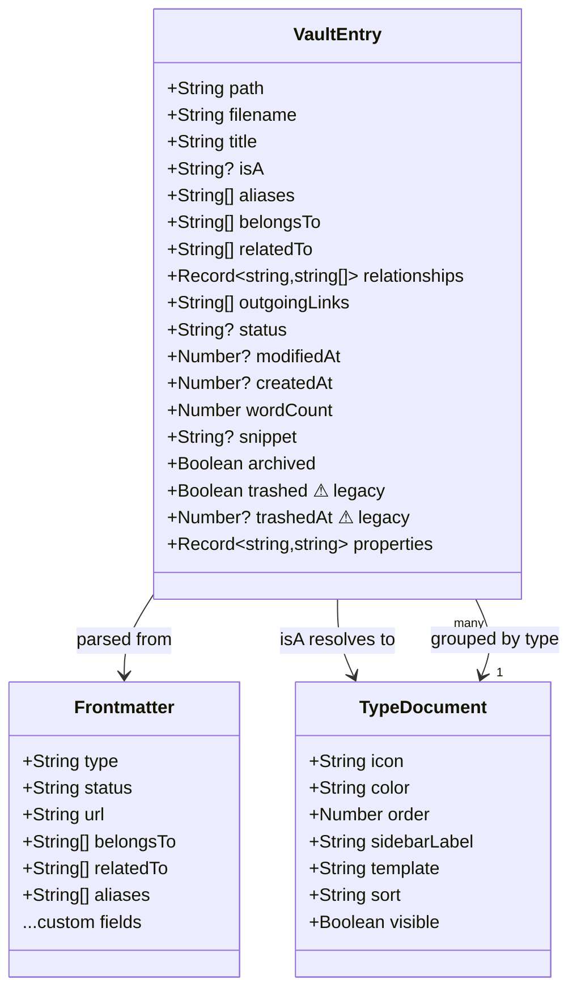
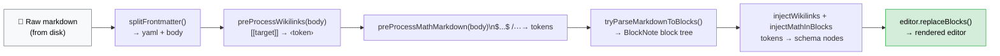
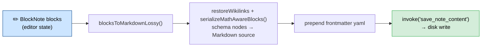

# Abstractions

Key abstractions and domain models in Tolaria.

## Design Philosophy

Tolaria's abstractions follow the **convention over configuration** principle: standard field names and folder structures have well-defined meanings and trigger UI behavior automatically. This makes vaults legible both to humans and to AI agents — the more a vault follows conventions, the less custom configuration an AI needs to navigate it correctly.

The full set of design principles is documented in [ARCHITECTURE.md](./ARCHITECTURE.md#design-principles).

## Semantic Field Names (conventions)

These frontmatter field names have special meaning in Tolaria's UI:

| Field | Meaning | UI behavior |
|---|---|---|
| `title:` | Legacy display-title fallback for older notes | Used only when a note has no H1; new notes do not write it automatically |
| `type:` | Entity type (Project, Person, Quarter…) | Type chip in note list + sidebar grouping |
| `status:` | Lifecycle stage (active, done, blocked…) | Colored chip in note list + editor header |
| `icon:` | Per-note icon (emoji, Phosphor name, or HTTP/HTTPS image URL) | Rendered on note title surfaces; editable from the Properties panel |
| `url:` | External link | Clickable link chip in editor header |
| `date:` | Single date | Formatted date badge |
| `start_date:` + `end_date:` | Duration/timespan | Date range badge |
| `goal:` + `result:` | Progress | Progress indicator in editor header |
| `Workspace:` | Vault context filter | Global workspace filter |
| `belongs_to:` | Parent relationship | Humanized to `Belongs to` in the UI |
| `related_to:` | Lateral relationship | Humanized to `Related to` in the UI |
| `has:` | Contained relationship | Humanized to `Has` in the UI |

Relationship fields are detected dynamically — any frontmatter field containing `[[wikilink]]` values is treated as a relationship (see [ADR-0010](adr/0010-dynamic-wikilink-relationship-detection.md)). Tolaria's own default relationship vocabulary uses snake_case on disk, but labels are humanized at render time and existing user-authored keys are left untouched.

### System Properties (underscore convention)

Any frontmatter field whose name starts with `_` is a **system property**:

- It is **not shown** in the Properties panel (neither for notes nor for Type notes)
- It is **not exposed** as a user-visible property in search, filters, or the UI
- It **is editable** directly in the raw editor (power users can access it if needed)
- It is used by Tolaria internally for configuration, behavior, and UI preferences

Examples:
```yaml
_pinned_properties:       # which properties appear in the editor inline bar (per-type)
  - key: status
    icon: circle-dot
_icon: shapes             # icon assigned to a type
_color: blue              # color assigned to a type
_order: 10                # sort order in the sidebar
_sidebar_label: Projects  # override label in sidebar
```

**This convention is universal** — apply it to all future system-level frontmatter fields. When a new feature needs to store configuration in a note's frontmatter (especially in Type notes), use `_field_name` to keep it hidden from normal user-facing surfaces while still stored on-disk as plain text.

The frontmatter parser (Rust: `vault/mod.rs`, TS: `utils/frontmatter.ts`) must filter out `_*` fields before passing `properties` to the UI.

## Document Model

All data lives in markdown files with YAML frontmatter. There is no database — the filesystem is the source of truth.

### VaultEntry

The core data type representing a single note, defined in Rust (`src-tauri/src/vault/mod.rs`) and TypeScript (`src/types.ts`).



```typescript
// src/types.ts
interface VaultEntry {
  path: string              // Absolute file path
  filename: string          // Just the filename
  title: string             // From first # heading, or filename fallback
  isA: string | null        // Entity type: Project, Procedure, Person, etc. (from frontmatter `type:` field)
  aliases: string[]         // Alternative names for wikilink resolution
  belongsTo: string[]       // Parent relationships (wikilinks)
  relatedTo: string[]       // Related entity links (wikilinks)
  relationships: Record<string, string[]>  // All frontmatter fields containing wikilinks
  outgoingLinks: string[]   // All [[wikilinks]] found in note body
  status: string | null     // Active, Done, Paused, Archived, Dropped
  modifiedAt: number | null // Unix timestamp (seconds)
  // Note: owner and cadence are now in the generic `properties` map
  createdAt: number | null  // Unix timestamp (seconds)
  fileSize: number
  wordCount: number | null  // Body word count (excludes frontmatter)
  snippet: string | null    // First 200 chars of body
  archived: boolean         // Archived flag
  trashed: boolean          // Kept for backward compatibility (Trash system removed — delete is permanent)
  trashedAt: number | null  // Kept for backward compatibility (Trash system removed)
  properties: Record<string, string>  // Scalar frontmatter fields (custom properties)
}
```

### Entity Types (isA / type)

Entity type is stored in the `type:` frontmatter field (e.g. `type: Quarter`). The legacy field name `Is A:` is still accepted as an alias for backwards compatibility but new notes use `type:`. The `VaultEntry.isA` property in TypeScript/Rust holds the resolved value.

Type is determined **purely** from the `type:` frontmatter field — it is never inferred from the file's folder location. All notes live at the vault root as flat `.md` files:

```
~/Laputa/
├── my-project.md          ← type: Project (in frontmatter)
├── weekly-review.md       ← type: Procedure
├── john-doe.md            ← type: Person
├── some-topic.md          ← type: Topic
├── AGENTS.md              ← canonical Tolaria AI guidance
├── CLAUDE.md              ← compatibility shim pointing at AGENTS.md
├── ...
└── type/                  ← type definition documents
```

New notes are created at the vault root: `{vault}/{slug}.md`. Changing a note's type only requires updating the `type:` field in frontmatter — the file does not move. Moving a note into a user folder is a separate filesystem concern: the folder path changes, but the note keeps the same filename and `type:` value. The `type/` folder exists solely for type definition documents. Legacy `config/` content is still recognized during migration and repair, but Tolaria's managed AI guidance now lives at the vault root.

A `flatten_vault` migration command is available to move existing notes from type-based subfolders to the vault root.

### Types as Files

Each entity type can have a corresponding **type document** in the `type/` folder (e.g., `type/project.md`, `type/person.md`). Type documents:

- Have `type: Type` in their frontmatter (`Is A: Type` also accepted as legacy alias)
- Define type metadata: icon, color, order, sidebar label, template, sort, view, visibility
- Are navigable entities — they appear in the sidebar under "Types" and can be opened/edited like any note
- Serve as the "definition" for their type category

**Type document properties** (read by Rust and used in the UI):

| Property | Type | Description |
|----------|------|-------------|
| `icon` | string | Type icon as a Phosphor name (kebab-case, e.g., "cooking-pot") |
| `color` | string | Accent color: red, purple, blue, green, yellow, orange |
| `order` | number | Sidebar display order (lower = higher priority) |
| `sidebar_label` | string | Custom label overriding auto-pluralization |
| `template` | string | Markdown template for new notes of this type |
| `sort` | string | Default sort: "modified:desc", "title:asc", "property:Priority:asc" |
| `view` | string | Default view mode: "all", "editor-list", "editor-only" |
| `visible` | bool | Whether type appears in sidebar (default: true) |

**Type relationship**: When any entry has an `isA` value (e.g., "Project"), the Rust backend automatically adds a `"Type"` entry to its `relationships` map pointing to `[[type/project]]`. This makes the type navigable from the Inspector panel.

**UI behavior**:
- Clicking a section group header pins the type document at the top of the NoteList if it exists
- Viewing a type document in entity view shows an "Instances" group listing all entries of that type
- The Type field in the Inspector is rendered as a clickable chip that navigates to the type document

### Frontmatter Format

Standard YAML frontmatter between `---` delimiters:

```yaml
---
title: Write Weekly Essays
type: Procedure
status: Active
belongs_to:
  - "[[grow-newsletter]]"
related_to:
  - "[[writing]]"
aliases:
  - Weekly Writing
---
```

Supported value types (defined in `src-tauri/src/frontmatter/yaml.rs` as `FrontmatterValue`):
- **String**: `status: Active`
- **Number**: `priority: 5`
- **Bool**: `archived: true`
- **List**: Multi-line `  - item` or inline `[item1, item2]`
- **Null**: `owner:` (empty value)

### Custom Relationships

The Rust parser scans all frontmatter keys for fields containing `[[wikilinks]]`. Any non-standard field with wikilink values is captured in the `relationships` HashMap:

```yaml
---
Topics:
  - "[[writing]]"
  - "[[productivity]]"
Key People:
  - "[[matteo-cellini]]"
---
```

Becomes: `relationships["Topics"] = ["[[writing]]", "[[productivity]]"]`

This enables arbitrary, extensible relationship types without code changes.

### Outgoing Links

All `[[wikilinks]]` in the note body (not frontmatter) are extracted by regex and stored in `outgoingLinks`. Used for backlink detection and relationship graphs.

### Title / Filename Sync

Tolaria separates **display title** from the file identifier:

- **Display title resolution** (`extract_title` in `vault/parsing.rs`): first `# H1` on the first non-empty body line, then legacy frontmatter `title:`, then slug-to-title from the filename stem.
- **Opening a note is read-only**: selecting a note does not inject or auto-correct `title:` frontmatter.
- **Explicit filename actions** (`rename_note`): breadcrumb rename/sync actions stage crash-safe note renames through a hidden `.tolaria-rename-txn/` transaction directory, recover unfinished renames on the next vault scan, update wikilinks across the vault, and surface any failed backlink rewrites instead of silently reporting partial success. The editor body remains the title editing surface.
- **Unicode-aware note stems** (`src/utils/noteSlug.ts`, `vault/rename.rs`): frontend and backend slugging preserve Unicode letters/digits in note filenames, untitled-rename detection, and fallback wikilink targets while still collapsing symbol-only titles to `untitled`.
- **Portable filename validation** (`vault/filename_rules.rs`): note filenames, folder names, and custom view filenames all reject Windows-reserved device names, invalid characters, and trailing dot/space suffixes so a vault created on macOS/Linux still clones and syncs cleanly on Windows.
- **Untitled drafts** start as `untitled-*.md` and are auto-renamed on save once the note gains an H1.

### Title Surface (UI)

The BlockNote body is the only title editing surface:

- The first H1 is the canonical display title.
- There is no separate title row above the editor, even when a note has no H1.
- Notes without an H1 show the editor body and placeholder only.
- Filename changes are explicit breadcrumb actions, not a dedicated title-input side effect.

### Sidebar Selection

Navigation state is modeled as a discriminated union:

```typescript
type SidebarFilter = 'all' | 'archived' | 'changes' | 'pulse'

type SidebarSelection =
  | { kind: 'filter'; filter: SidebarFilter }
  | { kind: 'sectionGroup'; type: string }    // e.g. type: 'Project'
  | { kind: 'folder'; path: string }
  | { kind: 'entity'; entry: VaultEntry }      // Neighborhood source note
  | { kind: 'view'; filename: string }
```

`SidebarSelection.kind === 'folder'` is a first-class navigation target, not just a visual highlight.

- `FolderTree` keeps the folder interaction surface decomposed into `FolderTreeRow`, `FolderNameInput`, `FolderContextMenu`, and disclosure/context-menu hooks so nested row rendering, inline rename, and right-click actions stay isolated.
- `useFolderActions()` composes `useFolderRename()` and `useFolderDelete()` to keep folder mutations selection-aware while the rest of `App.tsx` only wires the resulting callbacks into `Sidebar` and the command registry.
- `useNoteRetargeting()` is the shared retargeting abstraction for note drops and command-palette actions. It owns the "can drop here?" checks, updates `type:` via frontmatter when a note lands on a type section, and delegates folder moves through the same crash-safe rename pipeline used by the backend rename commands.
- A successful folder rename reloads the folder tree plus vault entries, rewrites any affected folder-scoped tabs, and updates `SidebarSelection` to the new relative path when the renamed folder stays selected.
- Folder deletion clears pending rename state, confirms destructive intent, drops affected folder-scoped tabs, reloads vault data, and resets folder selection if the deleted subtree owned the current selection.

### Neighborhood Mode

`SidebarSelection.kind === 'entity'` is Tolaria's Neighborhood mode for note-list browsing.

- The selected `entry` is the neighborhood source note.
- The source note stays pinned at the top of the note list as a standard active row, not a special card.
- Outgoing relationship groups render first using the note's `relationships` map.
- Inverse groups (`Children`, `Events`, `Referenced by`) and `Backlinks` render after the outgoing groups.
- Empty groups stay visible with count `0`.
- Notes may appear in multiple groups when multiple relationships are true; Neighborhood mode does not deduplicate them across sections.
- Plain click / `Enter` open the focused note without replacing the current Neighborhood.
- Cmd/Ctrl-click and Cmd/Ctrl-`Enter` open the note and pivot the note list into that note's Neighborhood.

## File System Integration

### Vault Scanning (Rust)

`vault::scan_vault(path)` in `src-tauri/src/vault/mod.rs`:

1. Validates the path exists and is a directory
2. Scans root-level `.md` files (non-recursive)
3. Recursively scans protected folders: `type/`, legacy `config/`, `attachments/`
4. Files in non-protected subfolders are **not indexed** (flat vault enforcement)
5. For each `.md` file, calls `parse_md_file()`:
   - Reads content with `fs::read_to_string()`
   - Parses frontmatter with `gray_matter::Matter::<YAML>`
   - Extracts title from first `#` heading
   - Reads entity type from `type:` frontmatter field (`Is A:` accepted as legacy alias); type is never inferred from folder
   - Parses dates as ISO 8601 to Unix timestamps
   - Extracts relationships, outgoing links, custom properties, word count, snippet

The folder tree hides only the dedicated `type/` directory, since note types already have their own sidebar section. Default vault folders such as `attachments/` and `views/` remain visible alongside user-created folders.
6. Sorts by `modified_at` descending
7. Skips unparseable files with a warning log

A `vault_health_check` command detects stray files in non-protected subfolders and filename-title mismatches. On vault load, a migration banner offers to flatten stray files to the root via `flatten_vault`.

Command-layer path access is fenced to the active vault before file operations reach the vault backend. `src-tauri/src/commands/vault/boundary.rs` canonicalizes the configured/requested vault root, rejects `..` escapes and absolute paths outside that root, and validates writable targets through the nearest existing ancestor so note reads, saves, deletes, view-file edits, folder mutations, and image attachment writes cannot step outside the active vault. Image attachment commands refresh the runtime asset scope after saving so files created under a previously missing `attachments/` directory can render immediately.

### Vault Caching

`vault::scan_vault_cached(path)` wraps scanning with git-based caching:

1. Reads cache from `~/.laputa/cache/<vault-hash>.json` (external to vault)
2. Compares cache version, vault path, and git HEAD commit hash
3. If cache is valid and same commit → only re-parse uncommitted changed files
4. If different commit → use `git diff` to find changed files → selective re-parse
5. If no cache → full scan
6. Replaces the cache with a temp-file write + rename only if a short-lived writer lock and cache fingerprint check show another scan has not already refreshed it
7. On first run, migrates any legacy `.laputa-cache.json` from inside the vault

### Frontmatter Manipulation (Rust)

`frontmatter/ops.rs:update_frontmatter_content()` performs line-by-line YAML editing:

1. Finds the frontmatter block between `---` delimiters
2. Iterates through lines looking for the target key
3. If found: replaces the value (consuming multi-line list items if present)
4. If not found: appends the new key-value at the end
5. If no frontmatter exists: creates a new `---` block

The `with_frontmatter()` helper wraps this in a read-transform-write cycle on the actual file.

### Content Loading

- **Tauri mode**: Content loaded on-demand when a tab is opened via `invoke('get_note_content', { path })`
- **Browser mode**: All content loaded at startup from mock data
- Content for backlink detection (`allContent`) is stored in memory as `Record<string, string>`

## Git Integration

Git operations live in `src-tauri/src/git/`. All operations shell out to the `git` CLI (not libgit2).

### Data Types

```typescript
interface GitCommit {
  hash: string
  shortHash: string
  message: string
  author: string
  date: number       // Unix timestamp
}

interface ModifiedFile {
  path: string          // Absolute path
  relativePath: string  // Relative to vault root
  status: 'modified' | 'added' | 'deleted' | 'untracked' | 'renamed'
}

interface GitRemoteStatus {
  branch: string
  ahead: number
  behind: number
  hasRemote: boolean
}

interface GitAddRemoteResult {
  status: 'connected' | 'already_configured' | 'incompatible_history' | 'auth_error' | 'network_error' | 'error'
  message: string
}

interface PulseCommit {
  hash: string
  shortHash: string
  message: string
  date: number
  githubUrl: string | null
  files: PulseFile[]
  added: number
  modified: number
  deleted: number
}
```

### Operations

| Module | Operation | Notes |
|--------|-----------|-------|
| `history.rs` | File history | `git log` — last 20 commits per file |
| `status.rs` | Modified files | `git status --porcelain` — filtered to `.md` |
| `status.rs` | File diff | `git diff`, fallback to `--cached`, then synthetic for untracked |
| `commit.rs` | Commit | `git add -A && git commit -m "..."`; broken signing helpers trigger one unsigned retry for the same app-managed commit |
| `remote.rs` | Pull / Push | `git pull --rebase` / `git push` |
| `connect.rs` | Add remote | Adds `origin`, fetches it, validates history compatibility, and only starts tracking when the remote is safe |
| `conflict.rs` | Conflict resolution | Detect conflicts, resolve with ours/theirs/manual |
| `pulse.rs` | Activity feed | `git log` with `--name-status` for file changes |

### Auto-Sync

`useAutoSync` hook handles automatic git sync:
- Configurable interval (from app settings: `auto_pull_interval_minutes`)
- Pulls on interval, pushes after commits
- Awaits the post-pull vault refresh so toasts land after note-list state is fresh
- Reopens the clean active tab from disk after a successful pull update so the editor and note list stay aligned
- Detects merge conflicts → opens `ConflictResolverModal`
- Tracks remote status (branch, ahead/behind via `git_remote_status`)
- Handles push rejection (divergence) → sets `pull_required` status
- `pullAndPush()`: pulls then auto-pushes for divergence recovery
- `ConflictNoteBanner`: inline banner in editor for conflicted notes (Keep mine / Keep theirs)

`useGitRemoteStatus` is the commit-time companion to `useAutoSync`:
- Re-checks `git_remote_status` when the Commit dialog opens and right before submit
- Converts `hasRemote: false` into a local-only commit path
- Keeps the normal push path unchanged for vaults that do have a remote

`AddRemoteModal` is the explicit recovery path for those local-only vaults:
- Opens from the `No remote` status-bar chip and the command palette
- Calls `git_add_remote` with the current vault path and the pasted repository URL
- Shows auth, network, and incompatible-history failures inline without rewriting the local vault's history

`useAutoGit` is the checkpoint-time companion to both hooks:
- Consumes installation-local AutoGit settings (`autogit_enabled`, idle threshold, inactive threshold)
- Tracks the last meaningful editor activity plus app focus/visibility transitions
- Triggers `useCommitFlow.runAutomaticCheckpoint()` only when the vault is git-backed, pending changes exist, and no unsaved edits remain
- Shares the same deterministic automatic commit message generator with the bottom-bar Commit button, so timer-driven checkpoints and manual quick commits produce the same `Updated N note(s)` / `Updated N file(s)` messages

### Frontend Integration

- **Modified file badges**: Orange dots in sidebar
- **Diff view**: Toggle in breadcrumb bar → shows unified diff
- **Git history**: Shown in Inspector panel for active note
- **Commit dialog**: Triggered from sidebar or Cmd+K
- **No remote indicator**: Neutral chip in the bottom bar when `GitRemoteStatus.hasRemote === false`
- **Pulse view**: Activity feed when Pulse filter is selected
- **Pull command**: Cmd+K → "Pull from Remote", also in Vault menu
- **Git status popup**: Click sync badge → shows branch, ahead/behind, Pull button
- **Conflict banner**: Inline banner in editor with Keep mine / Keep theirs for conflicted notes

## BlockNote Customization

The editor uses [BlockNote](https://www.blocknotejs.org/) for rich text editing, with CodeMirror 6 available as a raw editing alternative.

### Custom Wikilink Inline Content

Defined in `src/components/editorSchema.tsx`:

```typescript
const WikiLink = createReactInlineContentSpec(
  {
    type: "wikilink",
    propSchema: { target: { default: "" } },
    content: "none",
  },
  { render: (props) => <span className="wikilink">...</span> }
)
```

### Code Block Highlighting

Defined in `src/components/editorSchema.tsx` and styled in `src/components/EditorTheme.css`:

- The schema overrides BlockNote's default `codeBlock` spec with `createCodeBlockSpec({ ...codeBlockOptions, defaultLanguage: "text" })` from `@blocknote/code-block`.
- Fenced code blocks now use BlockNote's supported Shiki-backed highlighter path, which renders `.shiki` token spans directly inside the editor DOM.
- Tolaria keeps `defaultLanguage: "text"` so unlabeled code blocks do not silently become JavaScript while still supporting the packaged language aliases such as `ts` → `typescript`.
- Inline-code chip styling remains scoped to `.bn-inline-content code`, so fenced `pre > code` nodes keep BlockNote's dark shell instead of inheriting the muted inline surface.

### Markdown Math

Defined in `src/utils/mathMarkdown.ts`, `src/components/editorSchema.tsx`, and styled in `src/components/EditorTheme.css`:

- `$...$` becomes a `mathInline` schema node and line-owned `$$...$$` / multiline `$$` blocks become `mathBlock` nodes.
- The rich editor renders both node types through KaTeX with `throwOnError: false`, so malformed formulas keep their source visible instead of breaking the note.
- `serializeMathAwareBlocks()` converts math nodes back to Markdown delimiters before save, raw-mode entry, and editor-position snapshots.
- Raw CodeMirror mode always shows the plain Markdown source, so imported technical notes stay editable outside Tolaria.

### Formatting Surface Policy

Defined in `src/components/tolariaEditorFormatting.tsx` and `src/components/tolariaEditorFormattingConfig.ts`:

- `SingleEditorView` disables BlockNote's default formatting toolbar, `/` menu, and side menu, then mounts Tolaria-owned controllers so the visible formatting surface matches Tolaria's markdown round-trip guarantees.
- The formatting toolbar only exposes inline controls that persist through `blocksToMarkdownLossy()` in Tolaria's save pipeline: bold, italic, strike, nesting, and link creation. Controls that BlockNote can render temporarily but Tolaria cannot faithfully persist, such as underline, color, alignment, and the block-type dropdown, are hidden instead of appearing to work and later disappearing.
- Tolaria's formatting-toolbar controller also keeps file/image actions mounted across the tiny hover gap between an image block and the floating toolbar, and while the toolbar itself is hovered, so image controls remain usable instead of collapsing mid-interaction.
- The `/` slash menu remains the supported path for markdown-safe block transformations such as headings, quotes, and list blocks. Tolaria filters out BlockNote's toggle-heading and toggle-list variants because those do not map cleanly to the markdown note model.
- The block-handle side menu keeps only actions that survive Tolaria's markdown round-trip. Delete and table-header toggles remain available; BlockNote's `Colors` submenu is removed because block colors are not part of Tolaria's supported markdown surface.
- `useNoteWikilinkDrop()` is the shared editor-drop abstraction for dragging note rows into either editor mode. It reads the existing note-retargeting drag payload, resolves the vault-relative stem, and inserts a canonical `[[wikilink]]` without hijacking unrelated plain-text drags.

### Markdown-to-BlockNote Pipeline



> Wikilink placeholder tokens use `\u2039` and `\u203A`; math placeholder tokens use ASCII sentinels with URI-encoded LaTeX payloads.

### BlockNote-to-Markdown Pipeline (Save)



### Wikilink Navigation

Two navigation mechanisms:

1. **Click handler**: DOM event listener on `.editor__blocknote-container` catches clicks on `.wikilink` elements → `onNavigateWikilink(target)`.
2. **Suggestion menu**: Typing `[[` triggers `SuggestionMenuController` with filtered vault entries.

Wikilink resolution (`resolveEntry` in `src/utils/wikilink.ts`) uses multi-pass matching with global priority: filename stem (strongest) → alias → exact title → humanized title (kebab-case → words). No path-based matching — flat vault uses title/filename only. Legacy path-style targets like `[[person/alice]]` are supported by extracting the last segment.

### Raw Editor Mode

Toggle via Cmd+K → "Raw Editor" or breadcrumb bar button. Uses CodeMirror 6 (`useCodeMirror` hook) to edit the raw markdown + frontmatter directly. Changes saved via the same `save_note_content` command.
While the user types, `useEditorSaveWithLinks` derives a transient `VaultEntry` patch from parseable frontmatter so the Inspector, relationship chips, and note-list-visible metadata stay in sync with the raw editor before the next vault reload. Temporarily invalid or half-typed frontmatter is ignored until it becomes parseable again, which avoids clobbering the last known good derived state.

### Arrow Ligature Normalization

Typed ASCII arrow sequences are normalized consistently in both editor modes:

- Rich editor input mounts `createArrowLigaturesExtension()` (`src/components/arrowLigaturesExtension.ts`) into BlockNote and intercepts typed `beforeinput` events before ProseMirror commits the character.
- Raw editor input uses the CodeMirror `inputHandler` path in `useCodeMirror` so the same ligature rules apply while editing markdown source directly.
- Both paths delegate to the shared `resolveArrowLigatureInput()` helper in `src/utils/arrowLigatures.ts`, which prioritizes `<->` over partial matches, keeps paste literal, and lets escaped forms such as `\\->` and `\\<->` remain ASCII.

## Styling

The app uses internal light and dark themes owned by Tolaria (see [ADR-0081](adr/0081-internal-light-dark-theme-runtime.md)). The previous vault-authored theming system remains removed; theme mode is an installation-local app preference.

1. **Global CSS variables** (`src/index.css`): Semantic app colors, borders, surfaces, and interaction states via `:root` / `[data-theme]`, bridged to Tailwind v4
2. **Editor theme** (`src/theme.json`): BlockNote typography, flattened to CSS vars by `useEditorTheme`
3. **Runtime theme bridge**: Applies `data-theme` and `.dark` for shadcn/ui, while CodeMirror and editor-specific consumers derive any non-CSS-variable values from the same semantic contract

## Localization

App UI strings are centralized in `src/lib/i18n.ts` (see [ADR-0084](adr/0084-app-localization-foundation.md)):

- `AppLocale`: currently `'en' | 'zh-Hans'`
- `UiLanguagePreference`: `'system' | AppLocale`; persisted settings serialize `system` as `null`
- `resolveEffectiveLocale()`: maps an explicit preference or system/browser language list to the effective supported locale
- `translate()` / `createTranslator()`: resolve keys with English fallback and simple `{name}` interpolation

`App.tsx` owns the effective locale and passes it to localized app chrome through props. Settings and command-palette language commands call back into `saveSettings`, so UI language changes update the current session without touching vault content or reopening the vault.

## Inspector Abstraction

The Inspector panel (`src/components/Inspector.tsx`) is composed of sub-panels:

1. **DynamicPropertiesPanel** (`src/components/DynamicPropertiesPanel.tsx`): Renders frontmatter as editable key-value pairs:
   - **Editable properties** (top): Type badge, Status pill with dropdown, number fields, boolean toggles, array tag pills, text fields. Click-to-edit interaction.
   - **Property display modes**: `text`, `number`, `date`, `boolean`, `status`, `url`, `tags`, and `color`. Numeric frontmatter values auto-detect as `number`, and custom scalar keys can be explicitly switched to `Number` through the property-type control.
   - **Info section** (bottom, separated by border): Read-only derived metadata — Modified, Created, Words, File Size. Uses muted styling with no interaction.
   - Keys in `SKIP_KEYS` (`type`, `aliases`, `notion_id`, `workspace`, `is_a`, `Is A`) are hidden from the editable section.

2. **RelationshipsPanel**: Shows `belongs_to`, `related_to`, `has`, and all custom relationship fields as clickable wikilink chips. Relationship labels are humanized for display, but stored keys remain unchanged.

3. **BacklinksPanel**: Scans `allContent` for notes that reference the current note via `[[title]]` or `[[path]]`.

4. **GitHistoryPanel**: Shows recent commits from file history with relative timestamps.

## Search

### Search

Keyword-based search scans all vault `.md` files using `walkdir`:

```typescript
interface SearchResult {
  title: string
  path: string
  snippet: string
  score: number
}
```

### Search Integration

`SearchPanel` component provides the search UI:
- Real-time results as user types (300ms debounce)
- Click result to open note in editor
- Shows relevance score and snippet

No indexing step required — search runs directly against the filesystem.

## Vault Management

### Vault Switching

`useVaultSwitcher` hook manages multiple vaults:
- Persists vault list to `~/.config/com.tolaria.app/vaults.json` (reads legacy `com.laputa.app` on upgrade)
- Switching closes all tabs and resets sidebar
- Supports adding, removing, hiding/restoring vaults
- Default vault: public Getting Started starter vault cloned on demand

### Vault Config

Per-vault settings stored locally and scoped by vault path:
- Managed by `useVaultConfig` hook and `vaultConfigStore`
- Settings: zoom, view mode, editor mode, note layout, tag colors, status colors, property display modes, Inbox/All Notes note-list column overrides, explicit organization workflow toggle
- One-time migration from localStorage (`configMigration.ts`)

### AI Guidance Files

Tolaria tracks managed vault-level AI guidance separately from normal note content:
- `AGENTS.md` is the canonical managed guidance file for Tolaria-aware coding agents
- `CLAUDE.md` is a compatibility shim that points Claude Code back to `AGENTS.md`
- `useVaultAiGuidanceStatus` reads `get_vault_ai_guidance_status` and normalizes the backend state into four UI cases: `managed`, `missing`, `broken`, and `custom`
- `restore_vault_ai_guidance` repairs only Tolaria-managed files; user-authored custom `AGENTS.md` / `CLAUDE.md` files are surfaced as custom and left untouched
- The status bar AI badge and command palette consume that abstraction to expose restore actions only when the managed guidance is missing or broken

### Getting Started / Onboarding

`useOnboarding` hook detects first launch:
- If vault path doesn't exist → show `WelcomeScreen`
- User can create a new empty vault, open an existing folder, or clone the public Getting Started vault into a chosen parent folder; Tolaria derives the final `Getting Started` child path before cloning
- After the starter repo clone completes, Tolaria removes every remote so the new vault opens local-only by default
- Welcome state tracked in localStorage (`tolaria_welcome_dismissed`, with legacy fallback)

`useGettingStartedClone` encapsulates the non-onboarding Getting Started action:
- Opens the same parent-folder picker used by onboarding
- Derives the final `.../Getting Started` destination path
- Surfaces the resolved path through the app toast after a successful clone

`useAiAgentsOnboarding(enabled)` adds a separate first-launch agent step:
- Reads a local dismissal flag for the AI agents prompt (with a legacy fallback to the older Claude-only key)
- Only shows after vault onboarding has already resolved to a ready state
- Uses `get_ai_agents_status`, whose backend treats the app process path, login-shell path, and supported local/toolchain/app install locations, including Windows `.exe` and npm/pnpm/Scoop shim paths, as valid CLI-agent sources
- Persists dismissal locally once the user continues

### Remote Git Operations

Tolaria delegates remote auth to the user's system git setup:
- `CloneVaultModal` captures a remote URL and local destination
- `clone_git_repo` and `create_getting_started_vault` both run system git clone work in blocking Tokio tasks so clone UIs stay responsive
- `git_add_remote` uses the same system git path and refuses remotes whose history is unrelated or ahead of the local vault
- Existing `git_pull` / `git_push` commands keep surfacing raw git errors, and clone commands fail fast when git wants interactive terminal input
- No provider-specific token or username is stored in app settings

## Settings

App-level settings persisted at `~/.config/com.tolaria.app/settings.json` (reads legacy `com.laputa.app` on upgrade):

```typescript
interface Settings {
  auto_pull_interval_minutes: number | null
  autogit_enabled: boolean | null
  autogit_idle_threshold_seconds: number | null
  autogit_inactive_threshold_seconds: number | null
  telemetry_consent: boolean | null
  crash_reporting_enabled: boolean | null
  analytics_enabled: boolean | null
  anonymous_id: string | null
  release_channel: string | null // null = stable default, "alpha" = every-push prerelease feed
  theme_mode: 'light' | 'dark' | null
  ui_language: 'en' | 'zh-Hans' | null
  default_ai_agent: 'claude_code' | 'codex' | null
}
```

Managed by `useSettings` hook and `SettingsPanel` component. `theme_mode` is installation-local because it controls device comfort rather than vault structure. `ui_language` is also installation-local: `null` follows the supported system language with English fallback, while explicit values pin the UI language for this installation. `default_ai_agent` is an installation-local preference that selects which supported CLI agent the AI panel, command palette AI mode, and status bar should target by default. The AutoGit fields are also installation-local: `useAutoGit` consumes them to schedule automatic checkpoints, while `useCommitFlow` and the status bar quick action reuse the same checkpoint runner and deterministic automatic commit message generation.

## Telemetry

### Components
- **`TelemetryConsentDialog`** — First-launch dialog asking user to opt in to anonymous crash reporting. Two buttons: accept (sets `telemetry_consent: true`, generates `anonymous_id`) or decline.
- **`TelemetryToggle`** — Checkbox component in `SettingsPanel` for crash reporting and analytics toggles.

### Hooks
- **`useTelemetry(settings, loaded)`** — Reactively initializes/tears down Sentry and PostHog based on settings. Called once in `App`.

### Libraries
- **`src/lib/telemetry.ts`** — `initSentry()`, `teardownSentry()`, `initPostHog()`, `teardownPostHog()`, `trackEvent()`. Path scrubber via `beforeSend` hook. DSN/key from `VITE_SENTRY_DSN` / `VITE_POSTHOG_KEY` env vars.
- **`src/main.tsx`** — React root error callbacks (`onCaughtError`, `onUncaughtError`, `onRecoverableError`) forward component-stack context to `Sentry.reactErrorHandler()` for debuggable production React errors.
- **`src-tauri/src/telemetry.rs`** — Rust-side Sentry init with `beforeSend` path scrubber. `init_sentry_from_settings()` reads settings and conditionally initializes. `reinit_sentry()` for runtime toggle.

### Tauri Commands
- **`reinit_telemetry`** — Re-reads settings and toggles Rust Sentry on/off. Called from frontend when user changes crash reporting setting.

---

## Updates & Feature Flags

### Hooks
- **`useUpdater(releaseChannel)`** — Channel-aware updater state machine. Checks the selected feed, surfaces available/downloading/ready states, and delegates install work to Rust.
- **`useFeatureFlag(flag)`** — Returns boolean for a named feature flag. Checks `localStorage` override (`ff_<name>`), then falls back to telemetry-backed evaluation. Type-safe via `FeatureFlagName` union.

### Frontend helpers
- **`src/lib/releaseChannel.ts`** — Normalizes persisted channel values so legacy or invalid settings fall back to Stable, while Stable serializes back to `null`.
- **`src/lib/appUpdater.ts`** — Thin wrapper around the Tauri updater commands. Keeps the React hook free of endpoint-selection details.

### Rust
- **`src-tauri/src/app_updater.rs`** — Chooses the correct update endpoint (`alpha/latest.json` or `stable/latest.json`) and adapts Tauri updater results into frontend-friendly payloads.
- **`src-tauri/src/commands/version.rs`** — Formats app build/version labels for the status bar, including calendar alpha labels and legacy release compatibility.

### Tauri Commands
- **`check_for_app_update`** — Channel-aware update manifest lookup.
- **`download_and_install_app_update`** — Channel-aware download/install with streamed progress events.

### CI/CD
- **`.github/workflows/release.yml`** — Alpha prereleases from every push to `main` using calendar-semver technical versions (`YYYY.M.D-alpha.N`) and clean `Alpha YYYY.M.D.N` release names. GitHub alpha tags zero-pad the prerelease sequence (`alpha-vYYYY.M.D-alpha.NNNN`) so GitHub release ordering stays chronological while the shipped app version remains `YYYY.M.D-alpha.N`. Publishes `alpha/latest.json` with macOS Apple Silicon/Intel, Linux x64, and Windows x64 updater entries, then refreshes the legacy `latest.json` / `latest-canary.json` aliases to the alpha feed.
- **`.github/workflows/release-stable.yml`** — Stable releases from `stable-vYYYY.M.D` tags. Publishes `stable/latest.json`, macOS Apple Silicon and Intel DMG/updater artifacts, Windows x64 installers/updater bundles, and Linux x86_64 `.deb` / AppImage artifacts.
- **Beta cohorts** are handled in PostHog targeting only. There is no beta updater feed.
