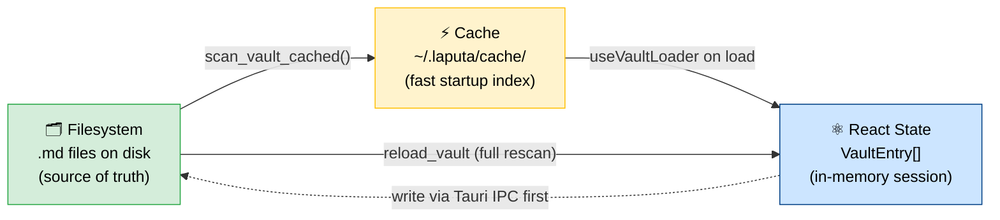
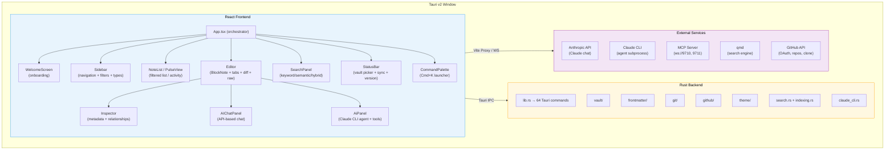
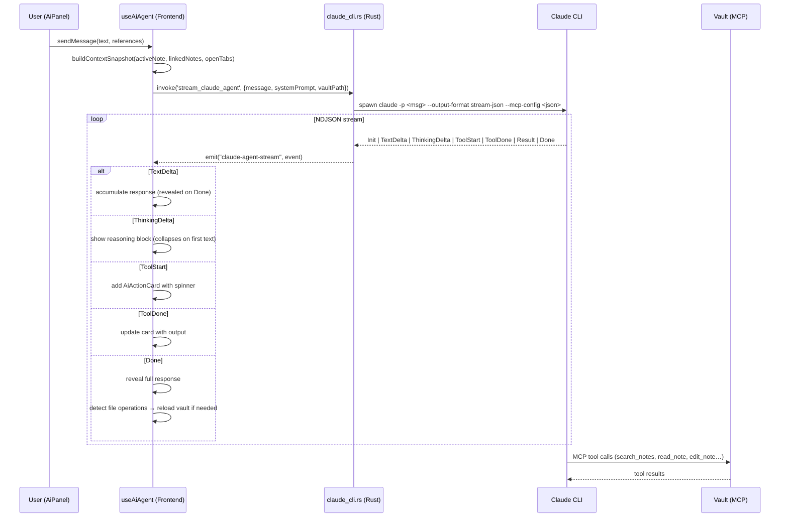
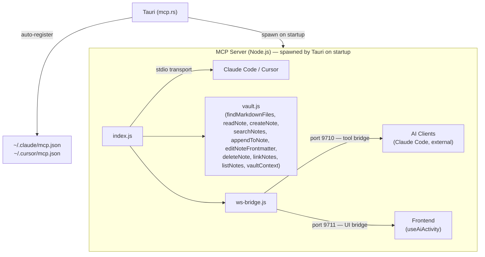
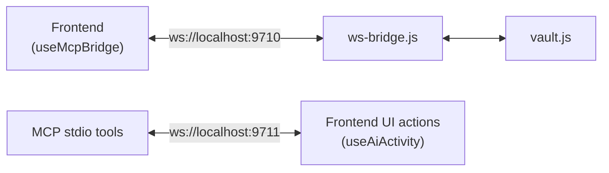
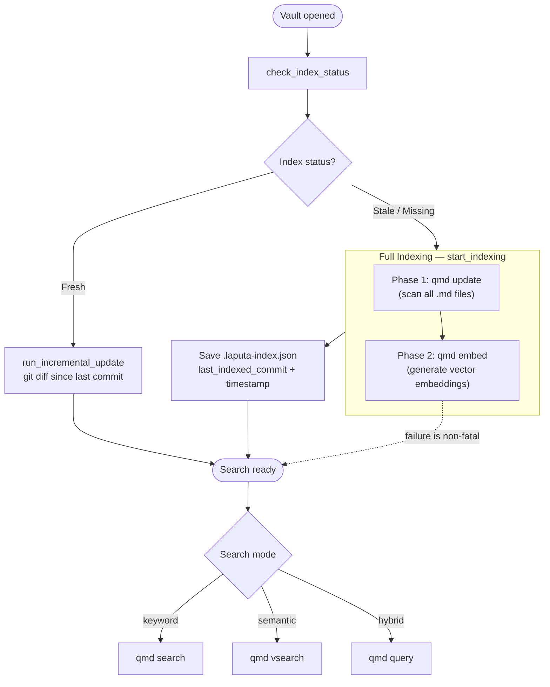
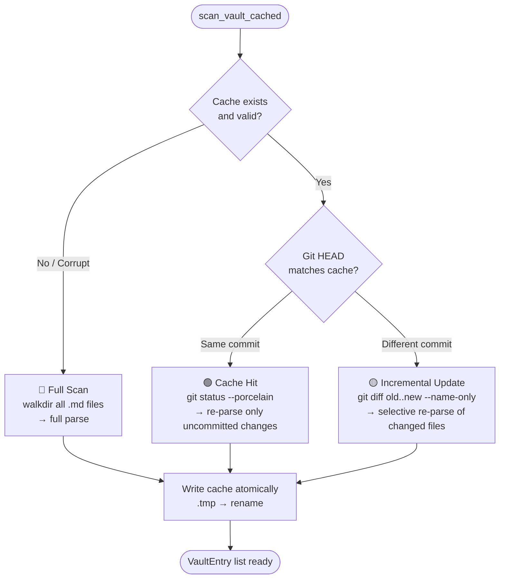
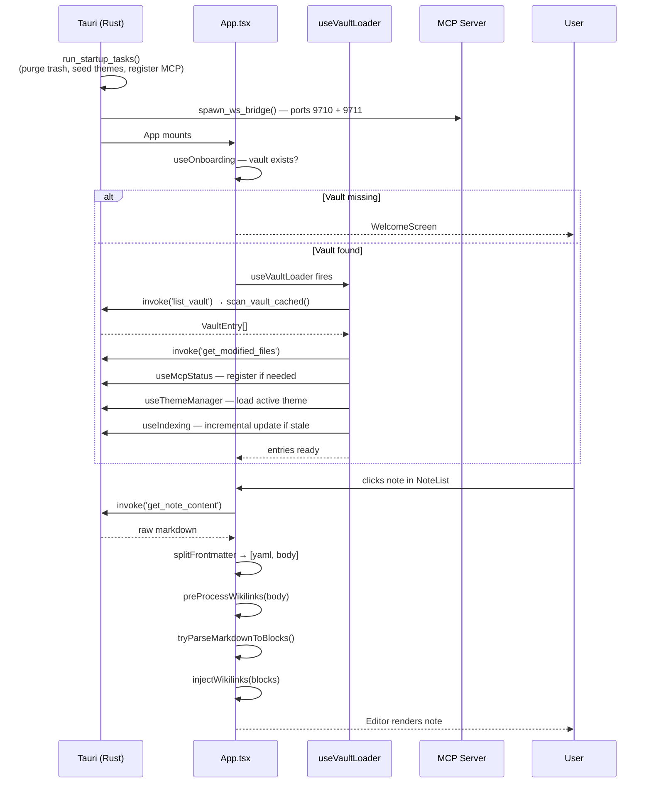
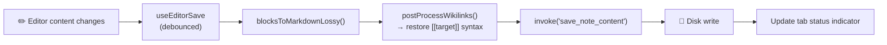
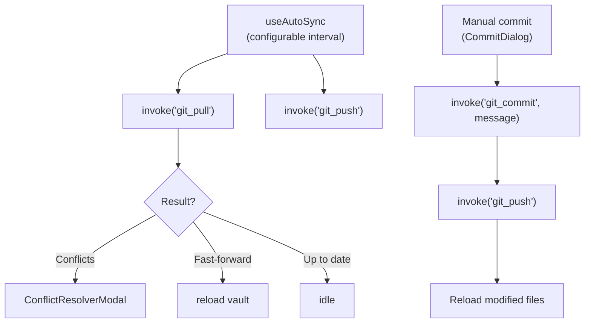

# Architecture

Laputa is a personal knowledge and life management desktop app. It reads a vault of markdown files with YAML frontmatter and presents them in a four-panel UI inspired by Bear Notes.

## Design Principles

### Filesystem as the single source of truth

The vault is a folder of plain markdown files. The app never owns the data — it only reads and writes files. The cache, React state, and any in-memory representation are always derived from the filesystem and must be reconstructible by deleting them. When in doubt, the file on disk wins.

### Convention over configuration

Laputa is opinionated. Standard field names (`type:`, `status:`, `url:`, `Workspace:`, `Belongs to:`, `start_date:`, `end_date:`) have well-defined meanings and trigger specific UI behavior — without any setup. This is not convention *instead of* configuration: users can override defaults via config files in their vault (e.g. `config/relations.md`, `config/semantic-properties.md`). But the defaults work out of the box, and most users never need to touch them.

This principle directly serves AI-readability: the more structure comes from shared conventions rather than per-user custom configurations, the easier it is for an AI agent to understand and navigate the vault correctly — without needing bespoke instructions for every setup.

### No hardcoded exceptions

No field names, folder paths, or vault-specific values should be hardcoded in the application source code. What can be a convention should be a convention. What needs to be configurable should live in a file. Relationship fields are detected dynamically by checking whether values contain `[[wikilinks]]` — no hardcoded field name lists.

### AI-first knowledge graph

Notes are not just documents — they are nodes in a structured graph of people, projects, events, responsibilities, and ideas. Every design decision should ask: "Does this make the knowledge graph easier for a human *and* an AI to navigate?" Conventions that are legible to both are better than conventions that are legible only to one.

### Three representations, one authority

Vault data exists in three forms simultaneously:
1. **Filesystem** — the `.md` files on disk. This is the single source of truth.
2. **Cache** — `~/.laputa/cache/<hash>.json`, an index for fast startup. Always reconstructible from the filesystem.
3. **React state** — the in-memory `VaultEntry[]` during a session. Always derived from the cache or filesystem.

These must never diverge permanently. If they do, the filesystem wins and the cache/state are rebuilt.



#### Ownership rules

| Layer | Owner | Writes to | Reads from |
|-------|-------|-----------|------------|
| Filesystem | Tauri Rust commands (`save_note_content`, `update_frontmatter`, etc.) | Disk | — |
| Cache | `scan_vault_cached()` in `vault/cache.rs` | `~/.laputa/cache/` | Filesystem + git diff |
| React state | `useVaultLoader` + `useEntryActions` + `useNoteActions` | In-memory `entries` | Cache (on load), filesystem (on reload) |

#### Invariants

1. **Disk-first writes**: All functions that change vault data must write to disk (via Tauri IPC) *before* updating React state. This ensures that if the disk write fails, React state remains consistent with what's actually on disk.
2. **Optimistic UI with rollback**: Where responsiveness matters (e.g. `persistOptimistic` in `useNoteCreation`), state may update before disk confirmation — but a failure callback must revert the optimistic state.
3. **No orphan state updates**: Never call `updateEntry()` before the corresponding `handleUpdateFrontmatter()` or `handleDeleteProperty()` has resolved. The three functions in `useEntryActions` (`handleCustomizeType`, `handleRenameSection`, `handleToggleTypeVisibility`) follow this rule — disk write first, then state update.
4. **Recovery via reload**: If state ever diverges from disk (crash, external edit, race condition), `Reload Vault` (Cmd+K → "Reload Vault") invalidates the cache and does a full filesystem rescan via the `reload_vault` Tauri command, replacing all React state. The `reload_vault_entry` command can re-read a single file.
5. **Cache is disposable**: The `reload_vault` command deletes the cache file before rescanning, guaranteeing fresh data. The cache never contains data that doesn't exist on the filesystem.

## Tech Stack

| Layer | Technology | Version |
|-------|-----------|---------|
| Desktop shell | Tauri v2 | 2.10.0 |
| Frontend | React + TypeScript | React 19, TS 5.9 |
| Editor | BlockNote | 0.46.2 |
| Raw editor | CodeMirror 6 | - |
| Styling | Tailwind CSS v4 + CSS variables | 4.1.18 |
| UI primitives | Radix UI + shadcn/ui | - |
| Icons | Phosphor Icons + Lucide | - |
| Build | Vite | 7.3.1 |
| Backend language | Rust (edition 2021) | 1.77.2 |
| Frontmatter parsing | gray_matter | 0.2 |
| AI (in-app chat) | Anthropic Claude API (Haiku 3.5 default) | - |
| AI (agent panel) | Claude CLI subprocess (streaming NDJSON) | - |
| Search | qmd (keyword + semantic + hybrid) | - |
| MCP | @modelcontextprotocol/sdk | 1.0 |
| Tests | Vitest (unit), Playwright (E2E/smoke), cargo test (Rust) | - |
| Package manager | pnpm | - |

## System Overview



## Four-Panel Layout

```
┌────────┬─────────────┬─────────────────────────┬────────────┐
│Sidebar │ Note List   │ Editor                  │ Inspector  │
│(250px) │ (300px)     │ (flex-1)                │ (280px)    │
│        │ OR          │                         │ OR         │
│ All    │ Pulse View  │ [Tab Bar]               │ AI Chat    │
│ Favs   │             │ [Breadcrumb Bar]        │ OR         │
│ Changes│ [Search]    │                         │ AI Agent   │
│ Pulse  │ [Sort/Filt] │ # My Note               │            │
│        │             │                         │ Context    │
│Projects│ Note 1      │ Content here...         │ Messages   │
│Experim.│ Note 2      │ (BlockNote or Raw)      │ Actions    │
│Respons.│ Note 3      │                         │ Input      │
│People  │ ...         │                         │            │
│Events  │             │                         │            │
│Topics  │             │                         │            │
├────────┴─────────────┴─────────────────────────┴────────────┤
│ StatusBar: v0.4.2 │ main │ Synced 2m ago │ Vault: ~/Laputa │
└──────────────────────────────────────────────────────────────┘
```

- **Sidebar** (150-400px, resizable): Top-level filters (All Notes, Favorites, Changes, Pulse) and collapsible type-based section groups. Each type can have a custom icon, color, sort, and visibility set via its type document in `type/`.
- **Note List / Pulse View** (200-500px, resizable): When a section group or filter is selected, shows filtered notes with snippets, modified dates, and status indicators. When Pulse filter is active, shows `PulseView` — a chronological git activity feed grouped by day.
- **Editor** (flex, fills remaining space): Tab bar with modified dots, breadcrumb bar with word count, BlockNote rich text editor with wikilink support. Can toggle to diff view (modified files) or raw CodeMirror view. Decomposed into `Editor` (orchestrator), `EditorContent`, `EditorRightPanel`, `SingleEditorView`, with hooks `useDiffMode`, `useEditorFocus`, `useEditorSave`, `useRawMode`.
- **Inspector / AI Chat / AI Agent** (200-500px or 40px collapsed): Toggles between Inspector (frontmatter, relationships, instances, backlinks, git history), AI Chat panel (API-based), and AI Agent panel (Claude CLI subprocess with tool execution). The Sparkle icon in the breadcrumb bar toggles between them. When viewing a Type note, the Inspector shows an **Instances** section listing all notes of that type (sorted by modified_at desc, capped at 50).

Panels are separated by `ResizeHandle` components that support drag-to-resize.

## AI System

Laputa has two AI interfaces with distinct architectures:

### AI Chat (AIChatPanel)

Simple chat mode — no tool execution, streaming text responses.

1. **Frontend** (`AIChatPanel` + `useAIChat` hook) — UI and state management
2. **API Proxy** (Vite middleware in dev, Rust `ai_chat` command in Tauri) — routes to Anthropic
3. **Context picker** — selected notes sent as system context with token estimation

### AI Agent (AiPanel)

Full agent mode — spawns Claude CLI as a subprocess with tool access and MCP vault integration.

1. **Frontend** (`AiPanel` + `useAiAgent` hook) — streaming UI with reasoning blocks, tool action cards, and response display
2. **Backend** (`claude_cli.rs`) — spawns `claude` binary with `--output-format stream-json`, parses NDJSON events
3. **MCP Integration** — passes vault MCP config via `--mcp-config` flag so the agent can search, read, and modify vault notes

#### Agent Event Flow



#### File Operation Detection

When the agent writes or edits vault files, `useAiAgent` detects this from tool inputs (Write/Edit tool JSON) and calls `onFileCreated` or `onFileModified` callbacks to trigger vault reload.

### Context Building

Both AI modes use context from the active note and linked entries. The agent panel (`ai-context.ts`) builds a structured JSON snapshot:

```json
{
  "activeNote": { "path", "title", "type", "frontmatter", "content" },
  "linkedNotes": [{ "path", "title", "content" }],
  "openTabs": [{ "title", "snippet" }],
  "vaultMetadata": { "noteTypes", "stats", "filter" },
  "references": [{ "title", "path", "type" }]
}
```

Token budget: 60% of 180k context limit (~108k tokens max). Active note gets priority, then linked notes, then truncation.

### Models (Chat mode)

| Model | ID | Use case |
|-------|----|----------|
| Haiku 3.5 | `claude-3-5-haiku-20241022` | Fast, cheap — default |
| Sonnet 4 | `claude-sonnet-4-20250514` | Balanced |
| Opus 4 | `claude-opus-4-20250514` | Most capable |

### API Key Management

- Stored in app settings (`~/.config/com.laputa.app/settings.json`) under `anthropic_key`
- Configurable via Settings panel (also supports `openai_key`, `google_key`)
- Claude CLI (agent mode) uses its own authentication — no API key needed

## MCP Server

The MCP server (`mcp-server/`) exposes vault operations as tools for AI assistants (Claude Code, Cursor, or any MCP-compatible client).

### Tool Surface (14 tools)

| Tool | Params | Description |
|------|--------|-------------|
| `open_note` | `path` | Open and read a note by relative path |
| `read_note` | `path` | Read note content (alias for `open_note`) |
| `create_note` | `path, title, [type]` | Create new note with title and optional type frontmatter |
| `search_notes` | `query, [limit]` | Search notes by title or content substring |
| `append_to_note` | `path, text` | Append text to end of existing note |
| `edit_note_frontmatter` | `path, patch` | Merge key-value patch into YAML frontmatter |
| `delete_note` | `path` | Delete a note file from the vault |
| `link_notes` | `source_path, property, target_title` | Add a target to an array property in frontmatter |
| `list_notes` | `[type_filter], [sort]` | List all notes, optionally filtered by type |
| `vault_context` | — | Get vault summary: entity types + 20 recent notes + configFiles |
| `ui_open_note` | `path` | Open a note in the Laputa UI editor |
| `ui_open_tab` | `path` | Open a note in a new UI tab |
| `ui_highlight` | `element, [path]` | Highlight a UI element (editor, tab, properties, notelist) |
| `ui_set_filter` | `type` | Set the sidebar filter to a specific type |

### Transports

- **stdio** — standard MCP transport for Claude Code / Cursor (`node mcp-server/index.js`)
- **WebSocket** — live bridge for Laputa app integration:
  - Port **9710**: Tool bridge — AI/Claude clients call vault tools here
  - Port **9711**: UI bridge — Frontend listens for UI action broadcasts from MCP tools

### Auto-Registration

On app startup, Laputa automatically registers itself as an MCP server in:
- `~/.claude/mcp.json` (Claude Code)
- `~/.cursor/mcp.json` (Cursor)

Registration is non-destructive (additive, preserves other servers) and uses `upsert` semantics. The `useMcpStatus` hook tracks registration state (`checking | installed | not_installed | no_claude_cli`).

### Architecture



### WebSocket Bridge



**Tool bridge protocol** (port 9710):
- Request: `{ "id": "req-1", "tool": "search_notes", "args": { "query": "test" } }`
- Response: `{ "id": "req-1", "result": { ... } }`

**UI bridge protocol** (port 9711):
- Broadcast: `{ "type": "ui_action", "action": "open_note", "path": "..." }`
- `useAiActivity` hook receives these and applies them (highlight with 800ms feedback, open note, set filter, etc.)

### Rust MCP Module

`src-tauri/src/mcp.rs` manages the MCP server lifecycle:

| Function | Purpose |
|----------|---------|
| `spawn_ws_bridge(vault_path)` | Spawns `ws-bridge.js` as child process with VAULT_PATH env |
| `register_mcp(vault_path)` | Writes Laputa entry to Claude Code and Cursor MCP configs |
| `upsert_mcp_config(path, entry)` | Atomic config file update (create/merge, preserves others) |

The `WsBridgeChild` state wrapper in `lib.rs` ensures the bridge process is killed on app exit via `RunEvent::Exit` handler.

## Search & Indexing

### Search Engine

Search uses the external `qmd` binary (semantic search engine) with three modes:

| Mode | Command | Description |
|------|---------|-------------|
| `keyword` | `qmd search` | Term matching (default) |
| `semantic` | `qmd vsearch` | Vector similarity search |
| `hybrid` | `qmd query` | Combined keyword + semantic |

### Indexing Flow



Embedding failure is non-fatal — keyword search still works.

### qmd Binary Resolution

1. Bundled macOS app resource: `<app>/Contents/Resources/qmd/qmd`
2. Dev mode: `CARGO_MANIFEST_DIR/resources/qmd/qmd`
3. System locations: `~/.bun/bin/qmd`, `/usr/local/bin/qmd`, `/opt/homebrew/bin/qmd`
4. PATH lookup via `which qmd`
5. Auto-install via `bun install -g qmd` if missing

## Vault Cache System

The vault cache (`src-tauri/src/vault/cache.rs`) accelerates vault scanning using git-based incremental updates.

### Cache File

`~/.laputa/cache/<vault-hash>.json` — stored outside the vault directory so it never pollutes the user's git repo. The vault path is hashed (via `DefaultHasher`) to produce a deterministic filename. Stores: vault path, git HEAD commit hash, all VaultEntry objects. Version: v5 (bumped on VaultEntry field changes to force full rescan). Writes are atomic (write to `.tmp` then rename). Legacy `.laputa-cache.json` files inside the vault are auto-migrated and deleted on first run.

### Three Cache Strategies



## Theme System

See [THEMING.md](./THEMING.md) for the full theme system documentation.

### Two-Layer Architecture

1. **Global CSS variables** (`src/index.css`): App-wide colors, borders, backgrounds. Bridged to Tailwind v4 via `@theme inline`.
2. **Editor theme** (`src/theme.json`): BlockNote-specific typography. Flattened to CSS vars by `useEditorTheme`.

### Vault-Based Themes

Themes are markdown notes in the `theme/` folder with `type: Theme` frontmatter (`Is A: Theme` accepted as legacy alias). Each frontmatter property becomes a CSS variable. Managed by `useThemeManager` hook and the `src-tauri/src/theme/` Rust module (create, seed, defaults).

- **Vault settings**: `.laputa/settings.json` stores the active theme reference
- **Legacy support**: `_themes/*.json` files still supported for backward compatibility
- **Built-in themes**: Default (light), Dark, Minimal — auto-seeded on vault open
- **Live preview**: Re-applies when the active theme note is saved

## Vault Management

### Vault List

Persisted at `~/.config/com.laputa.app/vaults.json`:
```json
{
  "vaults": [{ "label": "My Vault", "path": "/path/to/vault" }],
  "active_vault": "/path/to/vault",
  "hidden_defaults": []
}
```

Managed by `useVaultSwitcher` hook. Switching vaults closes all tabs and resets sidebar.

### Vault Config

Per-vault UI settings stored in `config/ui.config.md` (YAML frontmatter in a markdown note):
- `zoom`: Float zoom level (0.8–1.5)
- `view_mode`: "all" | "editor-list" | "editor-only"
- `editor_mode`: "raw" | "preview" (persists across tab switches and sessions)
- `tag_colors`, `status_colors`: Custom color overrides
- `property_display_modes`: Property display preferences

### Getting Started Vault

On first launch, `useOnboarding` checks if the default vault exists. If not, shows `WelcomeScreen` with two options:
- **Create Getting Started vault** → calls `create_getting_started_vault()` Tauri command
- **Open an existing folder** → system file picker

### GitHub OAuth Integration

Implements GitHub Device Authorization Flow for cloning/creating GitHub-backed vaults.

**Flow:**
1. User clicks "Login with GitHub" in Settings panel
2. `github_device_flow_start()` returns a user code + verification URL
3. User authorizes at `github.com/login/device`
4. App polls `github_device_flow_poll()` until authorized
5. Token stored in `~/.config/com.laputa.app/settings.json`

**Vault operations:**
- `GitHubVaultModal`: Clone existing repo or create new private/public repo
- `clone_repo()`: Clones with token-injected HTTPS URL
- Token persists for future git push/pull operations

## Pulse View

`PulseView` is a git activity feed that replaces the NoteList when the Pulse filter is selected.

- Groups commits by day ("Today", "Yesterday", or full date)
- Shows commit message, short hash, timestamp, and changed files
- Files have status icons (added/modified/deleted) and are clickable to open in editor
- Links to GitHub commits when `githubUrl` is available
- Infinite scroll pagination (20 commits per page) via Intersection Observer

Backend: `get_vault_pulse` Tauri command parses `git log` with `--name-status`.

## Data Flow

### Startup Sequence



### Auto-Save Flow



### Git Sync Flow



## Vault Module Structure

The vault backend (`src-tauri/src/vault/`) is split into focused submodules:

| File | Purpose |
|------|---------|
| `mod.rs` | Core types (`VaultEntry`, `Frontmatter`), `parse_md_file`, `scan_vault`, relationship/link extraction |
| `parsing.rs` | Text processing: snippet extraction, markdown stripping, ISO date parsing, `extract_title` |
| `cache.rs` | Git-based incremental vault caching (`scan_vault_cached`), git helpers |
| `trash.rs` | `purge_trash` — deletes trashed notes older than 30 days |
| `rename.rs` | `rename_note` — renames files and updates wikilinks across the vault |
| `image.rs` | `save_image` — saves base64-encoded attachments with sanitized filenames |
| `migration.rs` | `flatten_vault`, `vault_health_check`, `migrate_is_a_to_type` |
| `config_seed.rs` | Seeds `config/` folder, migrates `AGENTS.md`, repairs missing config files |
| `getting_started.rs` | Creates the Getting Started demo vault |

## Rust Backend Modules

| Module | Purpose |
|--------|---------|
| `vault/` | Vault scanning, caching, parsing, trash, rename, image, migration |
| `frontmatter/` | YAML frontmatter read/write (`mod.rs`, `yaml.rs`, `ops.rs`) |
| `git/` | Git operations (`commit.rs`, `status.rs`, `history.rs`, `conflict.rs`, `remote.rs`, `pulse.rs`) |
| `github/` | GitHub OAuth + API (`auth.rs`, `api.rs`, `clone.rs`) |
| `theme/` | Theme management (`mod.rs`, `create.rs`, `defaults.rs`, `seed.rs`) |
| `search.rs` | qmd search integration (keyword/semantic/hybrid) |
| `indexing.rs` | qmd indexing with progress streaming |
| `claude_cli.rs` | Claude CLI subprocess spawning + NDJSON stream parsing |
| `ai_chat.rs` | Direct Anthropic API client (non-streaming, for Tauri builds) |
| `mcp.rs` | MCP server spawning + config registration |
| `commands.rs` | All 62 Tauri command handlers |
| `settings.rs` | App settings persistence |
| `vault_config.rs` | Per-vault UI config |
| `vault_list.rs` | Vault list persistence |
| `menu.rs` | Native macOS menu bar |

## Tauri IPC Commands (64 total)

### Vault Operations

| Command | Description |
|---------|-------------|
| `list_vault` | Scan vault (cached) → `Vec<VaultEntry>` |
| `get_note_content` | Read note file content |
| `save_note_content` | Write note content to disk |
| `delete_note` | Move note to trash |
| `rename_note` | Rename note + update cross-vault wikilinks |
| `batch_archive_notes` | Archive multiple notes |
| `batch_trash_notes` | Trash multiple notes |
| `batch_delete_notes` | Permanently delete notes from disk |
| `empty_trash` | Permanently delete all trashed notes from disk |
| `purge_trash` | Delete notes trashed >30 days ago |
| `reload_vault` | Invalidate cache and full rescan from filesystem → `Vec<VaultEntry>` |
| `reload_vault_entry` | Re-read a single file from disk → `VaultEntry` |
| `check_vault_exists` | Check if vault path exists |
| `create_getting_started_vault` | Bootstrap demo vault |

### Frontmatter

| Command | Description |
|---------|-------------|
| `update_frontmatter` | Update a frontmatter property |
| `delete_frontmatter_property` | Remove a frontmatter property |

### Git

| Command | Description |
|---------|-------------|
| `git_commit` | Stage all + commit |
| `git_pull` | Pull from remote |
| `git_push` | Push to remote |
| `git_resolve_conflict` | Resolve a merge conflict |
| `git_commit_conflict_resolution` | Commit conflict resolution |
| `get_file_history` | Last N commits for a file |
| `get_modified_files` | `git status` filtered to .md |
| `get_file_diff` | Unified diff for a file |
| `get_file_diff_at_commit` | Diff at a specific commit |
| `get_conflict_files` | List conflicted files |
| `get_conflict_mode` | Get conflict resolution mode |
| `get_vault_pulse` | Git activity feed (paginated) |
| `get_last_commit_info` | Latest commit metadata |

### GitHub

| Command | Description |
|---------|-------------|
| `github_device_flow_start` | Begin OAuth device flow |
| `github_device_flow_poll` | Poll for authorization |
| `github_get_user` | Get authenticated user info |
| `github_list_repos` | List user's repos |
| `github_create_repo` | Create new repo |
| `clone_repo` | Clone repo with token auth |

### Search & Indexing

| Command | Description |
|---------|-------------|
| `search_vault` | Search via qmd (keyword/semantic/hybrid) |
| `get_index_status` | Check qmd index state |
| `start_indexing` | Full index with progress streaming |
| `trigger_incremental_index` | Incremental index update |

### Theme

| Command | Description |
|---------|-------------|
| `list_themes` | List all themes (legacy JSON) |
| `get_theme` | Read a theme file |
| `get_vault_settings` | Read `.laputa/settings.json` |
| `save_vault_settings` | Write vault settings |
| `set_active_theme` | Set active theme ID |
| `create_theme` | Create JSON theme from template |
| `create_vault_theme` | Create markdown theme note |
| `ensure_vault_themes` | Seed default themes if missing |
| `restore_default_themes` | Restore all default themes |
| `repair_vault` | Restore default themes + missing config files |

### AI & MCP

| Command | Description |
|---------|-------------|
| `ai_chat` | Direct Anthropic API call (non-streaming) |
| `stream_claude_chat` | Claude CLI chat mode (streaming) |
| `stream_claude_agent` | Claude CLI agent mode (streaming + tools) |
| `check_claude_cli` | Check if Claude CLI is available |
| `register_mcp_tools` | Register MCP in Claude/Cursor config |
| `check_mcp_status` | Check MCP registration state |

### Settings & Config

| Command | Description |
|---------|-------------|
| `get_settings` | Load app settings |
| `save_settings` | Save app settings |
| `load_vault_list` | Load vault list |
| `save_vault_list` | Save vault list |
| `get_vault_config` | Load per-vault UI config |
| `save_vault_config` | Save per-vault UI config |
| `get_default_vault_path` | Get default vault path |
| `get_build_number` | Get app build number |
| `save_image` | Save base64 image to vault |
| `copy_image_to_vault` | Copy image file to vault |
| `update_menu_state` | Update native menu checkmarks |

## Mock Layer

When running outside Tauri (browser at `localhost:5173`), `src/mock-tauri.ts` provides a transparent mock layer:

```typescript
if (isTauri()) {
  result = await invoke<T>('command_name', { args })
} else {
  result = await mockInvoke<T>('command_name', { args })
}
```

The mock layer includes sample entries across all entity types, full markdown content with realistic frontmatter, mock git history, mock AI responses, and mock pulse commits.

## State Management

No Redux or global context. State lives in the root `App.tsx` and custom hooks:

| State owner | State | Purpose |
|-------------|-------|---------|
| `App.tsx` | `selection`, panel widths, dialog visibility, toast, view mode | UI state |
| `useVaultLoader` | `entries`, `allContent`, `modifiedFiles` | Vault data |
| `useNoteActions` | `tabs`, `activeTabPath` | Composes `useNoteCreation` + `useNoteRename` + `frontmatterOps` |
| `useNoteCreation` | — (delegates to `useTabManagement`) | Note/type/daily-note creation with optimistic persistence |
| `useNoteRename` | — (delegates to `useTabManagement`) | Note renaming with wikilink update |
| `frontmatterOps` | — (pure functions) | Frontmatter CRUD: key→VaultEntry mapping, mock/Tauri dispatch |
| `useTabManagement` | Tab ordering, pinning, swapping, closed-tab history | Tab lifecycle |
| `useVaultSwitcher` | `vaultPath`, `extraVaults` | Vault switching |
| `useThemeManager` | `themes`, `activeThemeId`, `isDark` | Theme state |
| `useAIChat` | `messages`, `isStreaming` | AI chat conversation |
| `useAiAgent` | `messages`, `status`, tool actions | AI agent conversation |
| `useAutoSync` | Sync interval, pull/push state | Git auto-sync |
| `useIndexing` | Index status, progress | Search indexing |
| `useSettings` | App settings (API keys, GitHub token) | Persistent settings |
| `useVaultConfig` | Per-vault UI preferences | Vault-specific config |

Data flows unidirectionally: `App` passes data and callbacks as props to child components. No child-to-child communication — everything goes through `App`.

## Keyboard Shortcuts

| Shortcut | Action |
|----------|--------|
| Cmd+K | Open command palette |
| Cmd+P | Open quick open palette |
| Cmd+N | Create new note |
| Cmd+S | Save current note |
| Cmd+W | Close active tab |
| Cmd+Shift+T | Reopen last closed tab (LIFO history, up to 20) |
| Cmd+Z / Cmd+Shift+Z | Undo / Redo |
| Cmd+1–9 | Switch to tab N |
| Cmd+[ / Cmd+] | Navigate back / forward |
| `[[` in editor | Open wikilink suggestion menu |

## Auto-Release & In-App Updates

### Release Pipeline

Every push to `main` triggers `.github/workflows/release.yml`:

```
push to main
  → version job: compute 0.YYYYMMDD.RUN_NUMBER
  → build job (matrix: aarch64 + x86_64):
      → pnpm install, stamp version, pnpm build, tauri build --target <arch>
      → upload .app, .tar.gz + .sig, .dmg as artifacts
  → release job:
      → download both arch artifacts
      → lipo aarch64 + x86_64 → universal binary
      → create universal .dmg + signed updater tarball
      → generate latest.json (per-arch + universal platform entries)
      → publish GitHub Release with all assets + auto-generated notes
  → pages job:
      → build static HTML release history page
      → deploy to gh-pages
```

### Versioning

Format: `0.YYYYMMDD.GITHUB_RUN_NUMBER` (e.g. `0.20260223.42`). Stamped into `tauri.conf.json` and `Cargo.toml` dynamically.

### In-App Updates

```
App startup (3s delay)
  → useUpdater.check()
    → idle (no update) → no UI
    → available → UpdateBanner with release notes + "Update Now"
      → downloading → progress bar
        → ready → "Restart to apply" + Restart Now
    → network error → fail silently
```
