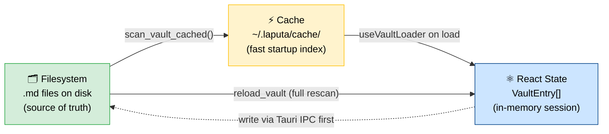
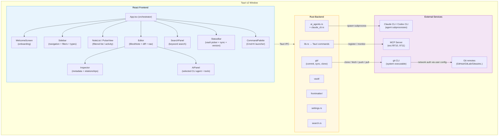
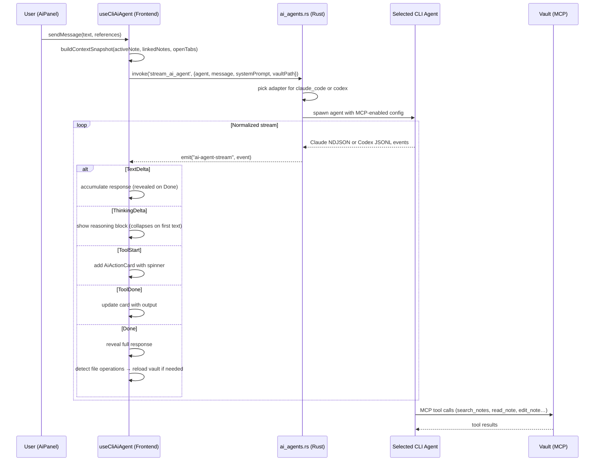
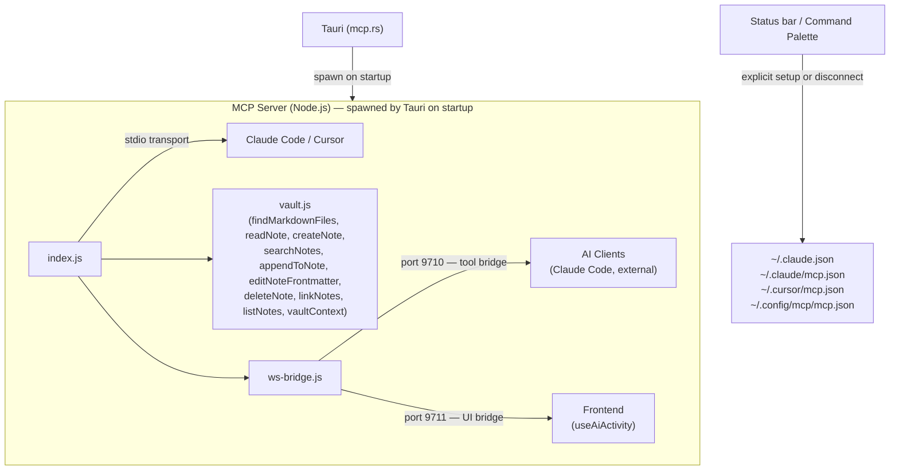
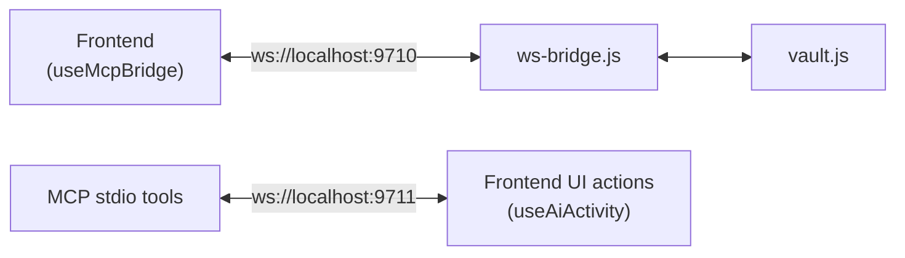
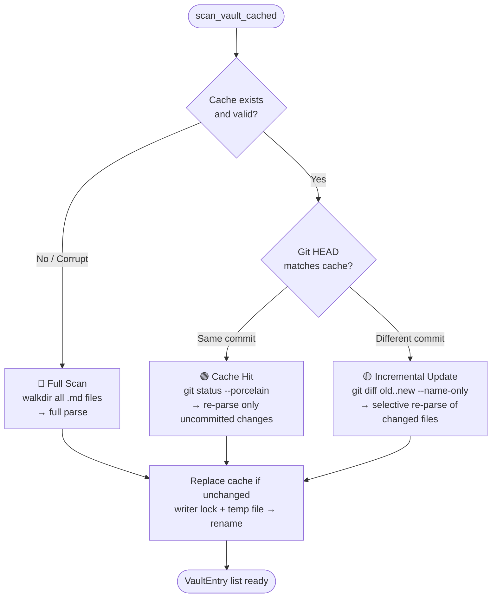
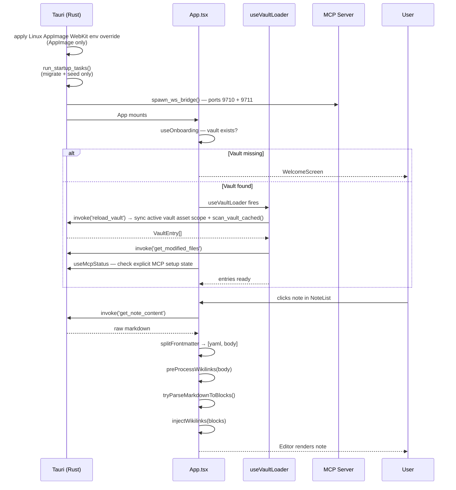
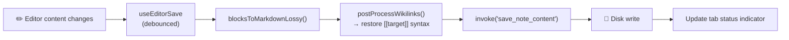
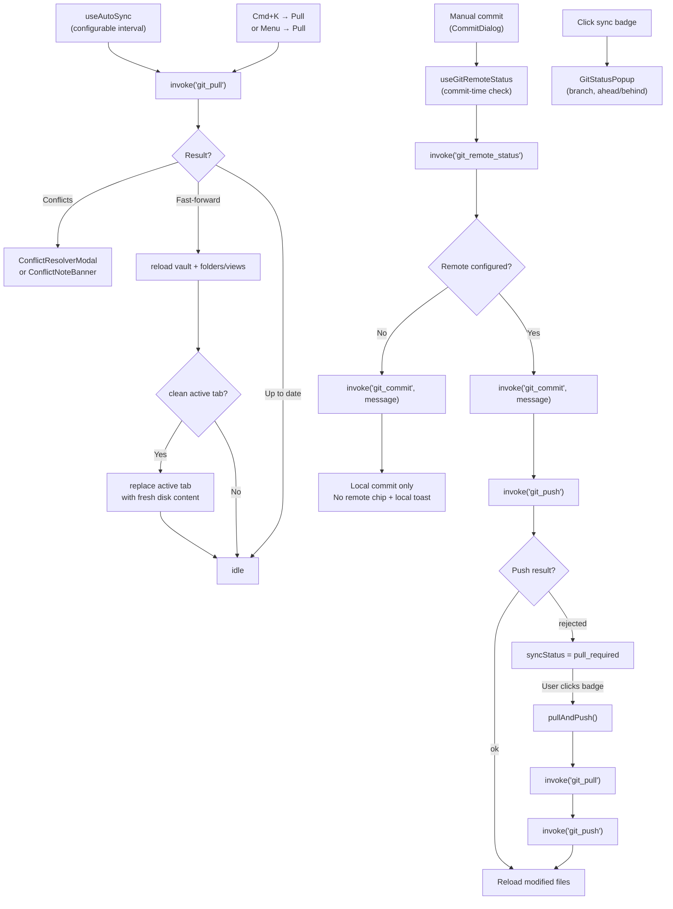
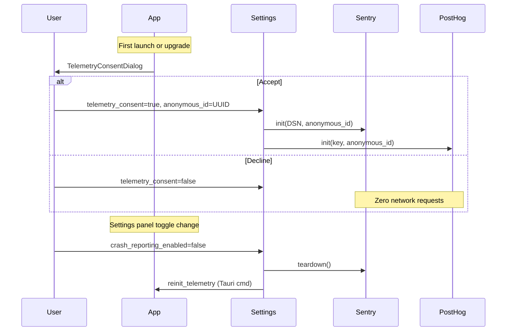

# Architecture

Tolaria is a personal knowledge and life management desktop app. It reads a vault of markdown files with YAML frontmatter and presents them in a four-panel UI inspired by Bear Notes.

## Design Principles

### Filesystem as the single source of truth

The vault is a folder of plain markdown files. The app never owns the data — it only reads and writes files. The cache, React state, and any in-memory representation are always derived from the filesystem and must be reconstructible by deleting them. When in doubt, the file on disk wins.

### Convention over configuration

Tolaria is opinionated. Standard field names (`type:`, `status:`, `url:`, `Workspace:`, `belongs_to:`, `related_to:`, `has:`, `start_date:`, `end_date:`) have well-defined meanings and trigger specific UI behavior — without any setup. Relationship defaults are stored in snake_case on disk and humanized in the UI. This is not convention *instead of* configuration: users can override defaults via config files in their vault (e.g. `config/relations.md`, `config/semantic-properties.md`). But the defaults work out of the box, and most users never need to touch them.

This principle directly serves AI-readability: the more structure comes from shared conventions rather than per-user custom configurations, the easier it is for an AI agent to understand and navigate the vault correctly — without needing bespoke instructions for every setup.

### Where to store state: vault vs. app settings

When deciding where to persist a piece of data, ask: **"Would the user want this to follow them across all their Tolaria installations — other devices, future platforms (tablet, web)?"**

| Follows the vault | Stays with the installation |
|-------------------|-----------------------------|
| Type icon, type color | Editor zoom level |
| Pinned properties per type | API keys (OpenAI, Google) |
| Sidebar label overrides | Auto-sync interval |
| Property display order | Window size / position |
| Any user-visible customization of how content is organized or displayed | Any machine-specific or credential-type setting |

**Rule:** If the information is about *how the content is structured or presented* and the user would expect it to be consistent wherever they open their vault, store it in the vault (frontmatter of the relevant note, using the `_field` underscore convention for system properties). If it's about *this specific installation of the app*, store it in `~/.config/com.tolaria.app/settings.json` or localStorage.

Examples:
- ✅ Vault: `_pinned_properties` in a Type note (every device should show the same pinned properties)
- ✅ Vault: `_icon: shapes` in a Type note (icon is part of the type's identity)
- ✅ App settings: `zoom: 1.3` (machine-specific preference)
- ✅ App settings: `ui_language: "zh-Hans"` (installation-specific UI language)

### No hardcoded exceptions

No field names, folder paths, or vault-specific values should be hardcoded in the application source code. What can be a convention should be a convention. What needs to be configurable should live in a file. Relationship fields are detected dynamically by checking whether values contain `[[wikilinks]]` — no hardcoded field name lists.

### AI-first knowledge graph

Notes are not just documents — they are nodes in a structured graph of people, projects, events, responsibilities, and ideas. Every design decision should ask: "Does this make the knowledge graph easier for a human *and* an AI to navigate?" Conventions that are legible to both are better than conventions that are legible only to one.

### Three representations, one authority

Vault data exists in three forms simultaneously:
1. **Filesystem** — the `.md` files on disk. This is the single source of truth.
2. **Cache** — `~/.laputa/cache/<hash>.json`, an index for fast startup. Always reconstructible from the filesystem.
3. **React state** — the in-memory `VaultEntry[]` during a session. Always derived from the cache or filesystem.

These must never diverge permanently. If they do, the filesystem wins and the cache/state are rebuilt.



#### Ownership rules

| Layer | Owner | Writes to | Reads from |
|-------|-------|-----------|------------|
| Filesystem | Tauri Rust commands (`save_note_content`, `update_frontmatter`, etc.) | Disk | — |
| Cache | `scan_vault_cached()` in `vault/cache.rs` | `~/.laputa/cache/` | Filesystem + git diff |
| React state | `useVaultLoader` + `useEntryActions` + `useNoteActions` | In-memory `entries` | Cache (on load), filesystem (on reload) |

#### Invariants

1. **Disk-first writes**: All functions that change vault data must write to disk (via Tauri IPC) *before* updating React state. This ensures that if the disk write fails, React state remains consistent with what's actually on disk.
2. **Optimistic UI with rollback**: Where responsiveness matters (e.g. `persistOptimistic` in `useNoteCreation`), state may update before disk confirmation — but a failure callback must revert the optimistic state.
3. **No orphan state updates**: Never call `updateEntry()` before the corresponding `handleUpdateFrontmatter()` or `handleDeleteProperty()` has resolved. The three functions in `useEntryActions` (`handleCustomizeType`, `handleRenameSection`, `handleToggleTypeVisibility`) follow this rule — disk write first, then state update.
4. **Recovery via reload**: If state ever diverges from disk (crash, external edit, race condition), `Reload Vault` (Cmd+K → "Reload Vault") invalidates the cache and does a full filesystem rescan via the `reload_vault` Tauri command, replacing all React state. The `reload_vault_entry` command can re-read a single file.
5. **Cache is disposable**: The `reload_vault` command deletes the cache file before rescanning, guaranteeing fresh data. The cache never contains data that doesn't exist on the filesystem.

## Tech Stack

| Layer | Technology | Version |
|-------|-----------|---------|
| Desktop shell | Tauri v2 | 2.10.0 |
| Frontend | React + TypeScript | React 19, TS 5.9 |
| Editor | BlockNote | 0.46.2 |
| Code block highlighting | @blocknote/code-block | 0.46.2 |
| Raw editor | CodeMirror 6 | - |
| Styling | Tailwind CSS v4 + CSS variables | 4.1.18 |
| UI primitives | Radix UI + shadcn/ui | - |
| Icons | Phosphor Icons + Lucide | - |
| Build | Vite | 7.3.1 |
| Backend language | Rust (edition 2021) | 1.77.2 |
| Frontmatter parsing | gray_matter | 0.2 |
| AI (agent panel) | CLI agent adapters (Claude Code + Codex) | - |
| Search | Keyword (walkdir-based file scan) | - |
| Localization | App-owned dictionary (`src/lib/i18n.ts`) | English fallback + `zh-Hans` |
| MCP | @modelcontextprotocol/sdk | 1.0 |
| Tests | Vitest (unit), Playwright (E2E/smoke), cargo test (Rust) | - |
| Package manager | pnpm | - |

## System Overview



## Four-Panel Layout

```
┌────────┬─────────────┬─────────────────────────┬────────────┐
│Sidebar │ Note List   │ Editor                  │ Inspector  │
│(250px) │ (300px)     │ (flex-1)                │ (280px)    │
│        │ OR          │                         │ OR         │
│ All    │ Pulse View  │ [Breadcrumb Bar]        │ AI Chat    │
│ Changes│             │                         │ OR         │
│ Pulse  │ [Search]    │ # My Note               │ AI Agent   │
│ Inbox  │ [Sort/Filt] │                         │            │
│        │             │                         │ Context    │
│Projects│ Note 1      │ Content here...         │ Messages   │
│Experim.│ Note 2      │ (BlockNote or Raw)      │ Actions    │
│Respons.│ Note 3      │                         │ Input      │
│People  │ ...         │                         │            │
│Events  │             │                         │            │
│Topics  │             │                         │            │
├────────┴─────────────┴─────────────────────────┴────────────┤
│ StatusBar: v0.4.2 │ main │ Synced 2m ago │ Vault: ~/Laputa │
└──────────────────────────────────────────────────────────────┘
```

- **Sidebar** (150-400px, resizable): Top-level filters (All Notes, Changes, Pulse), collapsible type-based section groups, and a dedicated folder tree. The folder tree shows user-created folders plus default vault folders such as `attachments/` and `views/`; only the dedicated `type/` directory stays hidden because note types already have their own sidebar section. The folder tree supports inline folder creation and rename, exposes a right-click menu for rename/delete, and auto-expands ancestor folders when the current selection or rename target is nested. Type sections and folder rows also act as note drop targets: dropping a note on a type updates its `type:` frontmatter, while dropping it on a folder runs the same crash-safe move path as the command palette flow. Each type can have a custom icon, color, sort, and visibility set via its type document in `type/`.
- **Note List / Pulse View** (200-500px, resizable): When a section group, filter, or saved view is selected, shows filtered notes with snippets, modified dates, status indicators, and per-context note-list controls. When `selection.kind === 'entity'`, the same pane enters **Neighborhood** mode: the source note is pinned at the top as a normal active row, outgoing relationship groups render first, inverse/backlink groups follow, empty groups stay visible with `0`, and duplicates across groups are allowed when multiple relationships are true. Plain click / `Enter` open the focused note without replacing the current Neighborhood, while Cmd/Ctrl-click and Cmd/Ctrl-`Enter` pivot the pane into the clicked note's Neighborhood. Saved views reuse the same sort and visible-column controls as the built-in lists, and those changes persist back into the view `.yml` definition (`sort`, `listPropertiesDisplay`). When Pulse filter is active, shows `PulseView` — a chronological git activity feed grouped by day.
- **Editor** (flex, fills remaining space): Single note open at a time (no tabs — see ADR-0003). Breadcrumb bar with word count and note-layout toggle, BlockNote rich text editor with wikilink support, Markdown-compatible inline/display math rendering, markdown-safe formatting controls, and schema-backed fenced code block highlighting via `@blocknote/code-block`. Can toggle to diff view (modified files), raw CodeMirror view, or a wide-screen left-aligned note column while preserving the same readable max width. Decomposed into `Editor` (orchestrator), `EditorContent`, `EditorRightPanel`, `SingleEditorView`, with hooks `useDiffMode`, `useEditorFocus`, and `useEditorSave`, plus the `useRawMode`/`RawEditorView` pair for markdown source editing. Rich BlockNote input and raw CodeMirror input both route typed `->`, `<-`, and `<->` through the shared `src/utils/arrowLigatures.ts` resolver so arrow ligatures stay consistent across mode switches while escaped ASCII sequences remain literal. Navigation history (Cmd+[/]) replaces tabs.
- **Inspector / AI Agent** (200-500px or 40px collapsed): Toggles between Inspector (frontmatter, relationships, instances, backlinks, git history) and AI Agent panel (the selected CLI agent with tool execution). The Sparkle icon in the breadcrumb bar toggles between them. Per-note `icon` is a suggested Inspector property and the command palette's "Set Note Icon" action opens that field directly. When viewing a Type note, the Inspector shows an **Instances** section listing all notes of that type (sorted by modified_at desc, capped at 50).

Panels are separated by `ResizeHandle` components that support drag-to-resize.

The main Tauri window derives its minimum width from the visible panes instead of a single fixed floor. `useMainWindowSizeConstraints` treats the editor-only shell as the 480px baseline, adds sidebar / note-list / expanded-inspector allowances on top, and calls the native `update_current_window_min_size` command whenever view mode or inspector visibility changes. That same native command also grows the current window back out when a wider pane combination is restored, while note windows skip this path and keep their dedicated 800×700 initial sizing.

Linux uses custom React-rendered window chrome instead of the native Tauri menu bar. `setup_linux_window_chrome()` drops server-side decorations on the main window, `openNoteInNewWindow()` does the same for detached note windows, and `LinuxTitlebar`/`LinuxMenuButton` route both window controls and menu actions back through the same shared command pipeline that macOS uses for native menu clicks.
When Tolaria is launched from a Linux AppImage, `run()` also injects `WEBKIT_DISABLE_DMABUF_RENDERER=1` unless the user already set that variable. This keeps the workaround scoped to bundled WebKitGTK launches that are prone to Fedora/Wayland DMA-BUF crashes without changing native package installs.

## Multi-Window (Note Windows)

Notes can be opened in separate Tauri windows for focused editing. Secondary windows show only the editor panel (no sidebar, no note list).

**Triggers:**
- `Cmd+Shift+Click` on any note in the note list or sidebar
- `Cmd+K` → "Open in New Window" (command palette, requires active note)
- `Cmd+Shift+O` keyboard shortcut
- Note → "Open in New Window" menu bar item

**Architecture:**
- `openNoteInNewWindow()` (`src/utils/openNoteWindow.ts`) creates a new `WebviewWindow` via the Tauri v2 JS API with URL query params (`?window=note&path=...&vault=...&title=...`)
- `main.tsx` checks `isNoteWindow()` at boot to route between `App` (main window) and `NoteWindow` (secondary window)
- `NoteWindow` (`src/NoteWindow.tsx`) is a minimal shell that loads vault entries, fetches note content, applies the theme, and renders a single `Editor` instance
- Each window has its own auto-save via `useEditorSaveWithLinks` (same 500ms debounce, same Rust `save_note_content` command), and raw-editor typing also derives frontmatter-backed `VaultEntry` state in the renderer so Inspector and note-list surfaces react immediately without waiting for a full reload
- Secondary windows are sized 800×700; macOS keeps the overlay title bar, while Linux mounts the shared React titlebar on undecorated windows
- Capabilities config (`src-tauri/capabilities/default.json`) grants permissions to both `main` and `note-*` window labels

## AI System

### AI Agent (AiPanel)

Full agent mode — spawns the selected local CLI agent as a subprocess with tool access and MCP vault integration.

1. **Frontend** (`AiPanel` + `useCliAiAgent` + `aiAgents.ts`) — streaming UI with reasoning blocks, tool action cards, response display, onboarding, and default-agent selection
2. **Backend** (`ai_agents.rs`) — normalizes agent availability and streaming, dispatching to per-agent adapters
3. **Agent adapters** — Claude Code still uses `claude_cli.rs`; Codex runs through `codex exec --json` with the CLI's normal approval / sandbox defaults
4. **MCP Integration** — Claude receives the generated MCP config file path, while Codex receives the same Tolaria MCP server via transient `-c mcp_servers.tolaria.*` config overrides

CLI-agent availability intentionally does not depend only on the desktop app's inherited `PATH`. The detectors check the current process path, the user's login shell, and supported local/toolchain install locations such as native `~/.local/bin`, local `~/.claude/local`, Mise/asdf shims, npm-global, Homebrew, Windows `%APPDATA%\npm`/pnpm/Scoop shims, Windows `.exe` launchers, and the macOS Codex app resource path so first-run onboarding works on fresh macOS and Windows installs.

#### Agent Event Flow



#### File Operation Detection

When the agent writes or edits vault files, `useCliAiAgent` detects this from normalized tool inputs and calls `onFileCreated` or `onFileModified` callbacks to trigger vault reload.

### Context Building

The agent panel (`ai-context.ts`) builds a structured JSON snapshot from the active note and linked entries:

```json
{
  "activeNote": { "path", "title", "type", "frontmatter", "content" },
  "linkedNotes": [{ "path", "title", "content" }],
  "openTabs": [{ "title", "snippet" }],
  "vaultMetadata": { "noteTypes", "stats", "filter" },
  "references": [{ "title", "path", "type" }]
}
```

Token budget: 60% of 180k context limit (~108k tokens max). Active note gets priority, then linked notes, then truncation.

### Authentication

Each CLI agent authenticates itself outside Tolaria. Claude Code uses its existing CLI login; Codex surfaces a friendly prompt to run `codex login` when needed. Tolaria does not store model-provider API keys in app settings.

## MCP Server

The MCP server (`mcp-server/`) exposes vault operations as tools for AI assistants (Claude Code, Cursor, or any MCP-compatible client).

### Tool Surface (14 tools)

| Tool | Params | Description |
|------|--------|-------------|
| `open_note` | `path` | Open and read a note by relative path |
| `read_note` | `path` | Read note content (alias for `open_note`) |
| `create_note` | `path, title, [type]` | Create new note with title and optional type frontmatter |
| `search_notes` | `query, [limit]` | Search notes by title or content substring |
| `append_to_note` | `path, text` | Append text to end of existing note |
| `edit_note_frontmatter` | `path, patch` | Merge key-value patch into YAML frontmatter |
| `delete_note` | `path` | Delete a note file from the vault |
| `link_notes` | `source_path, property, target_title` | Add a target to an array property in frontmatter |
| `list_notes` | `[type_filter], [sort]` | List all notes, optionally filtered by type |
| `vault_context` | — | Get vault summary: entity types + 20 recent notes + configFiles |
| `ui_open_note` | `path` | Open a note in the Tolaria UI editor |
| `ui_open_tab` | `path` | Open a note in a new UI tab |
| `ui_highlight` | `element, [path]` | Highlight a UI element (editor, tab, properties, notelist) |
| `ui_set_filter` | `type` | Set the sidebar filter to a specific type |

### Transports

- **stdio** — standard MCP transport for Claude Code / Cursor (`node mcp-server/index.js`)
- **WebSocket** — live bridge for Tolaria app integration:
  - Port **9710**: Tool bridge — AI/Claude clients call vault tools here
  - Port **9711**: UI bridge — Frontend listens for UI action broadcasts from MCP tools

### Explicit External Tool Setup

Tolaria can register itself as an MCP server in:
- `~/.claude.json` and `~/.claude/mcp.json` (Claude Code compatibility across current CLI and legacy MCP-file setups)
- `~/.cursor/mcp.json` (Cursor)
- `~/.config/mcp/mcp.json` (generic MCP-compatible clients)

That setup is user-initiated through the status bar / command palette flow, not a startup side effect. Registration is non-destructive (additive, preserves other servers), uses `upsert` semantics, and can be reversed by removing Tolaria's entry again. The `useMcpStatus` hook tracks whether the active vault is explicitly connected (`checking | installed | not_installed`).

### Architecture



### WebSocket Bridge



**Tool bridge protocol** (port 9710):
- Request: `{ "id": "req-1", "tool": "search_notes", "args": { "query": "test" } }`
- Response: `{ "id": "req-1", "result": { ... } }`

**UI bridge protocol** (port 9711):
- Broadcast: `{ "type": "ui_action", "action": "open_note", "path": "..." }`
- `useAiActivity` hook receives these and applies them (highlight with 800ms feedback, open note, set filter, etc.)

### Rust MCP Module

`src-tauri/src/mcp.rs` manages the MCP server lifecycle:

| Function | Purpose |
|----------|---------|
| `spawn_ws_bridge(vault_path)` | Spawns `ws-bridge.js` as child process with VAULT_PATH env |
| `register_mcp(vault_path)` | Writes Tolaria entry to Claude Code, Cursor, and generic MCP configs on explicit user request |
| `remove_mcp()` | Removes Tolaria's MCP entry from Claude Code, Cursor, and generic MCP configs |
| `upsert_mcp_config(path, entry)` | Atomic config file update (create/merge, preserves others) |

The `WsBridgeChild` state wrapper in `lib.rs` ensures the bridge process is killed on app exit via `RunEvent::Exit` handler. The same desktop layer now keeps the Tauri asset protocol scoped to the active vault instead of every filesystem path.

## Search

Search is keyword-based, using `walkdir` to scan all `.md` files in the vault directory. No external binary or indexing step required.

- Matches query against file titles and content (case-insensitive)
- Scores results: title matches ranked higher than content-only matches
- Extracts contextual snippets around the first match
- Skips hidden files

The `search_vault` Tauri command runs the scan in a blocking Tokio task and returns results sorted by relevance score.

## Vault Cache System

The vault cache (`src-tauri/src/vault/cache.rs`) accelerates vault scanning using git-based incremental updates.

### Cache File

`~/.laputa/cache/<vault-hash>.json` — stored outside the vault directory so it never pollutes the user's git repo. The vault path is hashed (via `DefaultHasher`) to produce a deterministic filename. Stores: vault path, git HEAD commit hash, all VaultEntry objects. Version: v13 (bumped on VaultEntry field changes to force full rescan). Cache replacement is best-effort: Tolaria writes a temp file, fsyncs it, and renames it into place only after a short-lived writer lock plus an on-disk fingerprint check confirm another window/process has not already refreshed the cache. Failures are logged and the app falls back to rebuilding from the filesystem.

`<vault>/.tolaria-rename-txn/` — hidden, scan-ignored staging directory for crash-safe note renames. Tolaria stores temporary backup files plus one manifest per in-flight rename here. On the next vault scan, unfinished transactions are recovered before entries are listed so users do not see a missing note or a visible duplicate after a crash.

### Three Cache Strategies



## Styling

The app uses internal app-owned light and dark themes (see [ADR-0081](adr/0081-internal-light-dark-theme-runtime.md)). This is not the old vault-authored theming system from ADR-0013: users choose a mode, but themes are owned by the app.

1. **Global CSS variables** (`src/index.css`): Semantic app colors, borders, surfaces, and interaction states. Bridged to Tailwind v4 via `@theme inline`.
2. **Editor theme** (`src/theme.json`): BlockNote-specific typography. Flattened to CSS vars by `useEditorTheme`; editor colors resolve through the same semantic app variables.
3. **Theme runtime**: Applies `data-theme` and the shadcn-compatible `.dark` class before React consumers render, with a localStorage mirror to avoid startup flash when dark mode is selected.

## Localization

Tolaria's app chrome uses an app-owned localization layer in `src/lib/i18n.ts` (see [ADR-0084](adr/0084-app-localization-foundation.md)). English is the canonical fallback, and Simplified Chinese (`zh-Hans`) is the first additional locale. The installation-local `ui_language` setting stores an explicit locale when the user chooses one; `null` means "follow the system language when Tolaria supports it, otherwise English." Missing translation keys fall back to English so partially translated locales do not render broken placeholders.

`App.tsx` derives the effective locale from settings and browser/system language hints, then passes it down to localized surfaces. Settings exposes a keyboard-accessible shadcn `Select`, and the command palette includes actions to open language settings or switch directly to a supported language.

## Vault Management

### Vault List

Persisted at `~/.config/com.tolaria.app/vaults.json` (reads legacy `com.laputa.app` on upgrade):
```json
{
  "vaults": [{ "label": "My Vault", "path": "/path/to/vault" }],
  "active_vault": "/path/to/vault",
  "hidden_defaults": []
}
```

Managed by `useVaultSwitcher` hook. Switching vaults resets sidebar and clears the active note.

### Vault Config

Per-vault UI settings stored locally per vault path (currently in browser/Tauri localStorage, not synced via git):
- `zoom`: Float zoom level (0.8–1.5)
- `view_mode`: "all" | "editor-list" | "editor-only"
- `editor_mode`: "raw" | "preview" (persists across note switches and sessions)
- `note_layout`: "centered" | "left" (wide-screen note column alignment for rich and raw editors)
- `tag_colors`, `status_colors`: Custom color overrides
- `property_display_modes`: Property display preferences
- `inbox.noteListProperties`: Optional Inbox-only property chip override for the note list
- `allNotes.noteListProperties`: Optional All Notes-only property chip override for the note list
- `inbox.explicitOrganization`: When `false`, hide Inbox and the organized toggle so the vault behaves like a plain note collection

### Getting Started Vault

On first launch, `useOnboarding` checks if the default vault exists. If not, it shows `WelcomeScreen` with three options:
- **Create a new vault** → creates an empty git repo in a folder the user chooses
- **Open an existing folder** → system file picker
- **Get started with a template** → pick a parent folder, then call `create_getting_started_vault()` with the derived `.../Getting Started` child path so the cloned vault opens into the populated repo root immediately

When an opened folder is not yet a git repo, `init_git_repo` runs `git init`, ensures Tolaria's default `.gitignore`, stages the vault, and writes the initial `Initial vault setup` commit. That app-managed setup commit explicitly disables commit signing for the single command so inherited global or local `commit.gpgsign` preferences cannot strand onboarding when GPG is missing or misconfigured. Later `git_commit` calls honor the user's signing configuration first, then retry the same app-managed commit once with `commit.gpgsign=false` only when Git reports a signing-helper failure, so working GPG/SSH signing setups continue to sign while broken GPG setups do not create repeated opaque commit failures.

Once a vault is ready, `useAiAgentsOnboarding` can show a one-time `AiAgentsOnboardingPrompt`. That prompt reads `useAiAgentsStatus` so first launch surfaces whether Claude Code and Codex are installed, offers per-agent install links when they are missing, and stores local dismissal so the prompt does not repeat on every launch.

`useGettingStartedClone` reuses the same parent-folder semantics for the status-bar / command-palette clone action, and `Toast` is rendered through the AI-agents onboarding gate so the resolved destination path stays visible right after a successful clone.

The starter content no longer lives in the app repo. `src-tauri/src/vault/getting_started.rs` holds the public starter repo URL (`refactoringhq/tolaria-getting-started`), delegates the clone to the git backend, then normalizes Tolaria-managed root guidance and type scaffolding (`AGENTS.md`, `CLAUDE.md`, `type.md`, `note.md`) so fresh starter vaults pick up the current defaults even when the remote starter repo still carries a legacy copy or an older pre-`type:` `is_a`-era template. `AGENTS.md` stays the canonical vault guidance file; `CLAUDE.md` is a compatibility shim that imports it for Claude Code without duplicating the instructions, and Tolaria seeds it as an organized `Note` so it stays out of the way in a fresh vault. The clone helper still accepts the legacy `LAPUTA_GETTING_STARTED_REPO_URL` environment override so older automation can continue to redirect the starter source during the transition.

After the clone completes, Tolaria removes every configured git remote from the new starter vault. Getting Started vaults therefore open as local-only by default, and users opt into a remote later with the explicit Add Remote flow.

### Remote Clone & Auth Model

Tolaria no longer implements provider-specific OAuth or remote-repository APIs. All remote git work goes through the user's existing system git configuration.

**Flow:**
1. User opens `CloneVaultModal` from onboarding or the vault menu
2. User pastes any git URL and chooses a local destination
3. The `clone_git_repo()` Tauri command runs `git clone` inside a blocking Tokio task so the Tauri window stays responsive during slow or failing clones
4. `git_push()` / `git_pull()` continue to use the same system git path
5. Clone commands disable interactive terminal / askpass prompts and surface the git failure back to the UI instead of freezing the app waiting for input

**Auth model:**
- SSH keys, Git Credential Manager, macOS Keychain helpers, `gh auth`, and other git helpers all work without app-specific setup
- No provider tokens are stored in Tolaria settings
- The same flow works for GitHub, GitLab, Bitbucket, Gitea, and self-hosted remotes

## Pulse View

`PulseView` is a git activity feed that replaces the NoteList when the Pulse filter is selected.

- Groups commits by day ("Today", "Yesterday", or full date)
- Shows commit message, short hash, timestamp, and changed files
- Files have status icons (added/modified/deleted) and are clickable to open in editor
- Links to GitHub commits when `githubUrl` is available
- Infinite scroll pagination (20 commits per page) via Intersection Observer

Backend: `get_vault_pulse` Tauri command parses `git log` with `--name-status`.

## Data Flow

### Startup Sequence



### Auto-Save Flow



### Git Sync Flow



`useGitRemoteStatus` re-checks `git_remote_status` when the commit dialog opens and again right before submit. If `hasRemote` is false, Tolaria keeps the flow local-only: the status bar shows a neutral `No remote` chip, the dialog copy switches from "Commit & Push" to "Commit", and no `git_push` call is attempted.

The same local-only state enables the explicit Add Remote flow. `AddRemoteModal` is reachable from the `No remote` chip and the command palette. The backend `git_add_remote` command adds `origin`, fetches it, refuses incompatible histories, and only enables tracking after a safe push or fast-forward-compatible check succeeds.

`useCommitFlow` also exposes `runAutomaticCheckpoint()`, a dialog-free commit path shared by AutoGit and the bottom-bar Commit button. `useAutoGit` watches the last editor activity plus app focus/visibility state, and when the vault is git-backed, all saves are flushed, and no unsaved edits remain, it triggers the same deterministic `Updated N note(s)` / `Updated N file(s)` commit message path after the configured idle or inactive thresholds. The bottom-bar quick action reuses that checkpoint flow after forcing a save first, so manual quick commits and scheduled AutoGit commits stay aligned on message generation and push behavior.

#### Sync States

| State | Indicator | Color | Trigger |
|-------|-----------|-------|---------|
| `idle` | Synced / Synced Xm ago | green | Successful sync |
| `syncing` | Syncing... | blue | Pull/push in progress |
| `pull_required` | Pull required | orange | Push rejected (divergence) |
| `conflict` | Conflict | orange | Merge conflicts detected |
| `error` | Sync failed | grey | Network/auth error |

## Vault Module Structure

The vault backend (`src-tauri/src/vault/`) is split into focused submodules:

| File | Purpose |
|------|---------|
| `mod.rs` | Core types (`VaultEntry`, `Frontmatter`), `parse_md_file`, `scan_vault`, relationship/link extraction |
| `parsing.rs` | Text processing: snippet extraction, markdown stripping, ISO date parsing, `extract_title` (H1 → legacy frontmatter → filename), `slug_to_title` |
| `title_sync.rs` | Legacy filename → `title` frontmatter sync helper; no longer used by the normal note-open flow |
| `cache.rs` | Git-based incremental vault caching (`scan_vault_cached`), git helpers |
| `filename_rules.rs` | Cross-platform validation for note filenames, folder names, and custom view filenames |
| `rename.rs` | `rename_note` / `rename_note_filename` / `move_note_to_folder` — stage crash-safe file moves, update `title` frontmatter when needed, recover unfinished rename transactions, and report backlink rewrite failures |
| `image.rs` | `save_image` / `copy_image_to_vault` — save editor image attachments with sanitized filenames |
| `migration.rs` | `flatten_vault`, `vault_health_check`, `migrate_is_a_to_type` |
| `config_seed.rs` | Maintains vault AI guidance (`AGENTS.md` + `CLAUDE.md` shim), migrates legacy `config/agents.md`, and repairs missing root type scaffolding such as `type.md` and `note.md` |
| `getting_started.rs` | Clones and normalizes the public Getting Started starter vault |

## Rust Backend Modules

| Module | Purpose |
|--------|---------|
| `vault/` | Vault scanning, caching, parsing, rename, image, migration |
| `frontmatter/` | YAML frontmatter read/write (`mod.rs`, `yaml.rs`, `ops.rs`) |
| `git/` | Git operations (`commit.rs`, `status.rs`, `history.rs`, `conflict.rs`, `remote.rs`, `pulse.rs`, `clone.rs`, `connect.rs`) |
| `search.rs` | Keyword search — walkdir-based vault file scan |
| `ai_agents.rs` | Shared CLI-agent detection, stream normalization, and adapter dispatch |
| `claude_cli.rs` | Claude Code subprocess spawning + NDJSON stream parsing |
| `mcp.rs` | MCP server spawning + explicit config registration/removal |
| `commands/` | Tauri command handlers (split into submodules) |
| `settings.rs` | App settings persistence |
| `vault_config.rs` | Per-vault UI config |
| `vault_list.rs` | Vault list persistence |
| `menu.rs` | Native desktop menu definitions and command IDs (not mounted on Linux) |

## Tauri IPC Commands

### Vault Operations

| Command | Description |
|---------|-------------|
| `list_vault` | Scan vault (cached) → `Vec<VaultEntry>` |
| `get_note_content` | Read note file content |
| `save_note_content` | Write note content to disk |
| `delete_note` | Permanently delete note from disk (with confirm dialog) |
| `rename_note` | Crash-safe note rename + `title` frontmatter update + cross-vault wikilinks + failed backlink counts |
| `move_note_to_folder` | Crash-safe folder move that preserves the filename, reloads the moved note, and rewrites path-based wikilinks |
| `create_vault_folder` | Create a folder relative to the active vault root |
| `rename_vault_folder` | Rename a folder relative to the active vault root and return old/new relative paths |
| `delete_vault_folder` | Permanently delete a folder subtree relative to the active vault root |
| `sync_note_title` | Legacy helper: rewrite `title` frontmatter from filename → `bool` (modified); not used by the normal note-open flow |
| `batch_archive_notes` | Archive multiple notes |
| `batch_delete_notes` | Permanently delete notes from disk |
| `reload_vault` | Sync the active vault asset scope, invalidate cache, and full rescan from filesystem → `Vec<VaultEntry>` |
| `reload_vault_entry` | Re-read a single file from disk → `VaultEntry` |
| `check_vault_exists` | Check if vault path exists |
| `create_empty_vault` | Create a git-backed vault, then seed root `AGENTS.md`, `CLAUDE.md`, `type.md`, and `note.md` defaults |
| `create_getting_started_vault` | Clone the public Getting Started vault, refresh Tolaria-managed guidance/config defaults, and keep the cloned repo clean |
| `get_vault_ai_guidance_status` | Report whether `AGENTS.md` and the `CLAUDE.md` shim are managed, missing, broken, or custom |
| `restore_vault_ai_guidance` | Restore any missing/broken Tolaria-managed guidance files without overwriting custom ones |

### Frontmatter

| Command | Description |
|---------|-------------|
| `update_frontmatter` | Update a frontmatter property |
| `delete_frontmatter_property` | Remove a frontmatter property |

### Git

| Command | Description |
|---------|-------------|
| `init_git_repo` | Initialize a local repo, add default `.gitignore`, and create the unsigned setup commit |
| `git_commit` | Stage all + commit |
| `git_pull` | Pull from remote |
| `git_push` | Push to remote |
| `git_remote_status` | Get branch name + ahead/behind counts |
| `git_add_remote` | Connect a local-only vault to a compatible remote and start tracking it |
| `git_resolve_conflict` | Resolve a merge conflict |
| `git_commit_conflict_resolution` | Commit conflict resolution |
| `get_file_history` | Last N commits for a file |
| `get_modified_files` | `git status` filtered to .md |
| `get_file_diff` | Unified diff for a file |
| `get_file_diff_at_commit` | Diff at a specific commit |
| `get_conflict_files` | List conflicted files |
| `get_conflict_mode` | Get conflict resolution mode |
| `get_vault_pulse` | Git activity feed (paginated) |
| `get_last_commit_info` | Latest commit metadata |
| `clone_repo` | Clone a remote repository into a local folder using system git |

### Search

| Command | Description |
|---------|-------------|
| `search_vault` | Keyword search across vault files |

### Vault Maintenance

| Command | Description |
|---------|-------------|
| `get_vault_settings` | Read `.laputa/settings.json` |
| `save_vault_settings` | Write vault settings |
| `repair_vault` | Flatten vault structure, migrate legacy frontmatter, restore root config/type defaults including `note.md` |

### AI & MCP

| Command | Description |
|---------|-------------|
| `stream_claude_chat` | Claude CLI chat mode (streaming) |
| `stream_claude_agent` | Claude CLI agent mode (streaming + tools) |
| `check_claude_cli` | Check if Claude CLI is available |
| `get_ai_agents_status` | Check Claude Code + Codex availability |
| `stream_ai_agent` | Stream the selected CLI agent through the normalized event layer |
| `register_mcp_tools` | Register MCP in Claude/Cursor/generic config for the active vault |
| `remove_mcp_tools` | Remove Tolaria's MCP entry from Claude/Cursor/generic config |
| `check_mcp_status` | Check whether the active vault is explicitly registered in Claude/Cursor/generic config |

The desktop MCP WebSocket bridge is intentionally local-only. `mcp-server/ws-bridge.js` binds both bridge ports to loopback, rejects non-loopback clients, accepts browser/Tauri origins only on the UI bridge, and rejects browser-origin requests on the tool bridge so remote pages cannot drive vault tools directly.

### Settings & Config

| Command | Description |
|---------|-------------|
| `get_settings` | Load app settings |
| `save_settings` | Save app settings |
| `load_vault_list` | Load vault list |
| `save_vault_list` | Save vault list |
| `get_vault_config` | Load per-vault UI config |
| `save_vault_config` | Save per-vault UI config |
| `get_default_vault_path` | Get default vault path |
| `get_build_number` | Get app build number |
| `save_image` | Save base64 image to `attachments/` and refresh the active vault asset scope |
| `copy_image_to_vault` | Copy image file to `attachments/` and refresh the active vault asset scope |
| `update_menu_state` | Update native menu checkmarks and enabled/disabled state for selection-dependent actions |
| `trigger_menu_command` | Emit a native menu command ID for deterministic shortcut QA |
| `update_current_window_min_size` | Update the active Tauri window's minimum size and optionally grow it to fit restored panes |

`get_build_number` feeds the bottom status bar label. It preserves legacy `bNNN` date-build labels, renders local `0.1.0` / `0.0.0` builds as `dev`, formats calendar alpha builds as `Alpha YYYY.M.D.N`, strips any calendar `-stable.N` suffix back to `YYYY.M.D`, and keeps legacy semver releases readable instead of falling back to `?`.

## Mock Layer

When running outside Tauri (browser at `localhost:5173`), `src/mock-tauri.ts` provides a transparent mock layer:

```typescript
if (isTauri()) {
  result = await invoke<T>('command_name', { args })
} else {
  result = await mockInvoke<T>('command_name', { args })
}
```

The mock layer includes sample entries across all entity types, full markdown content with realistic frontmatter, mock git history, mock AI responses, and mock pulse commits. It also tracks per-vault remote state so browser-mode Getting Started and empty-vault flows now behave like the desktop app: local-only until `git_add_remote` succeeds.

Browser smoke tests can also override `window.__mockHandlers` before the app boots. The AutoGit smoke bridge uses that path directly for seeded saves so the mocked git dirty-state stays synchronized even when the optional browser vault API is serving note content.

## State Management

No Redux or global context. State lives in the root `App.tsx` and custom hooks:

| State owner | State | Purpose |
|-------------|-------|---------|
| `App.tsx` | `selection`, panel widths, dialog visibility, toast, view mode | UI state |
| `useVaultLoader` | `entries`, `allContent`, `modifiedFiles` | Vault data |
| `useNoteActions` | `tabs`, `activeTabPath` | Composes `useNoteCreation` + `useNoteRename` + `frontmatterOps` |
| `useNoteCreation` | — | Note/type creation with optimistic persistence |
| `useNoteRename` | — | Note renaming and folder moves with wikilink update |
| `useNoteRetargeting` | — | Shared note retargeting logic for drag/drop and command-palette actions |
| `frontmatterOps` | — (pure functions) | Frontmatter CRUD: key→VaultEntry mapping, mock/Tauri dispatch |
| `useTabManagement` | Navigation history, note switching | Note navigation lifecycle |
| `useVaultSwitcher` | `vaultPath`, `extraVaults` | Vault switching |
| `useTheme` | Editor theme CSS vars and theme-mode bridge | Editor typography and app theme runtime |
| `useCliAiAgent` | `messages`, `status`, tool actions | Selected AI agent conversation |
| `useAutoSync` | Sync interval, pull/push state | Git auto-sync |
| `useAutoGit` | Last activity timestamp, idle/inactive checkpoint triggers | Automatic commit/push checkpoints |
| `useCommitFlow` | Commit dialog state, shared manual/automatic checkpoint runner | Git commit/push orchestration |
| `useGitRemoteStatus` | `remoteStatus`, `refreshRemoteStatus()` | On-demand remote detection for commit UI |
| `useUnifiedSearch` | Query, results, loading state | Keyword search |
| `useSettings` | App settings (telemetry, release channel, theme mode, UI language, auto-sync interval, AutoGit thresholds, default AI agent) | Persistent settings |
| `useVaultConfig` | Per-vault UI preferences | Vault-specific config |
| `appCommandDispatcher` | Canonical shortcut/menu command IDs | Shared execution path for renderer and native menu commands |

Data flows unidirectionally: `App` passes data and callbacks as props to child components. No child-to-child communication — everything goes through `App`.

## Keyboard Shortcuts

| Shortcut | Action |
|----------|--------|
| Cmd+K | Open command palette |
| Cmd+P / Cmd+O | Open quick open palette |
| Cmd+N | Create new note |
| Cmd+S | Save current note |
| Cmd+[ / Cmd+] | Navigate back / forward (replaces tabs) |
| Cmd+Z / Cmd+Shift+Z | Undo / Redo |
| Cmd+1–9 | Switch to tab N |
| Cmd+[ / Cmd+] | Navigate back / forward |
| `[[` in editor | Open wikilink suggestion menu |

Selection-dependent actions are wired through the command palette and the native menus. For example, a deleted file opened from Changes view becomes a read-only diff preview, and that state enables the "Restore Deleted Note" menu/command while normal note mutation actions stay disabled. Folder selection follows the same pattern: when `selection.kind === 'folder'`, the command palette exposes "Rename Folder" and "Delete Folder", and the sidebar row can launch the same flows directly through inline rename or the folder context menu. Active notes now follow the same shared-action model for retargeting: Cmd+K can open "Change Note Type…" and "Move Note to Folder…", and the sidebar drop targets call the same hook-backed implementations instead of maintaining separate mutation paths.

Shortcut routing is explicit:

- `appCommandCatalog.ts` is the shared shortcut manifest for command IDs, modifier rules, and deterministic QA metadata
- `formatShortcutDisplay()` derives platform-accurate visible shortcut labels (`⌘` on macOS, `Ctrl` on Windows/Linux) from that same manifest so menus, tooltips, and command-palette copy stay aligned with real accelerators
- `useAppKeyboard` is the primary execution path for real shortcut keypresses, including Tauri runs
- macOS browser-reserved chords such as `Cmd+O` and `Cmd+Shift+L` are unblocked at webview init via `tauri-plugin-prevent-default`, then continue through the same renderer-first command path
- `menu.rs`, `useMenuEvents`, and Linux's `LinuxMenuButton` emit the same command IDs for native menu clicks, accelerators, and custom titlebar menu actions
- `appCommandDispatcher.ts` suppresses the paired native-menu/renderer echo from a single shortcut so the command runs once
- Deterministic QA uses two explicit proof paths from the shared manifest:
  - renderer shortcut-event proof through `window.__laputaTest.triggerShortcutCommand()`
  - native menu-command proof through `trigger_menu_command`
- The browser harness is only a deterministic desktop command bridge; exact native accelerator delivery still requires real Tauri QA for commands flagged as manual-native-critical

## Auto-Release & In-App Updates

### Release Pipeline

Every push to `main` triggers `.github/workflows/release.yml`:

```
push to main
  → version job: compute calendar alpha version YYYY.M.D-alpha.N
    and a GitHub-sorted tag alpha-vYYYY.M.D-alpha.NNNN
      → use today's UTC date unless the latest stable-vYYYY.M.D tag already uses today
      → if stable already uses today, advance alpha to the next calendar day so semver still increases
  → build job:
      → pnpm install, stamp version, pnpm build, tauri build --target aarch64-apple-darwin --bundles app
      → pnpm install, stamp version, pnpm build, tauri build --target x86_64-apple-darwin --bundles app
      → upload signed Apple Silicon and Intel .app.tar.gz + .sig updater artifacts
  → build-windows job:
      → pnpm install, stamp version, tauri build --target x86_64-pc-windows-msvc --bundles nsis
      → upload NSIS installer, optional MSI artifacts, and signed Windows updater bundles
  → release job:
      → generate alpha-latest.json with darwin-aarch64, darwin-x86_64, Linux, and Windows updater URLs
      → publish GitHub prerelease alpha-vYYYY.M.D-alpha.NNNN named Tolaria Alpha YYYY.M.D.N
  → pages job:
      → build static HTML release history page
      → publish alpha/latest.json
      → refresh latest.json + latest-canary.json as compatibility aliases to alpha
      → preserve stable/latest.json
      → deploy to gh-pages
```

Stable promotions trigger `.github/workflows/release-stable.yml`:

```
push stable-vYYYY.M.D tag
  → version job: validate YYYY.M.D from the tag
  → build job:
      → pnpm install, stamp version, pnpm build, tauri build --target aarch64-apple-darwin
      → pnpm install, stamp version, pnpm build, tauri build --target x86_64-apple-darwin
      → upload signed Apple Silicon and Intel .app.tar.gz + .sig and .dmg artifacts
  → build-linux job:
      → pnpm install, stamp version, tauri build --target x86_64-unknown-linux-gnu --bundles deb,appimage
      → upload .deb, .AppImage, and signed Linux updater bundles
  → build-windows job:
      → pnpm install, stamp version, tauri build --target x86_64-pc-windows-msvc --bundles nsis
      → upload NSIS installer, optional MSI artifacts, and signed Windows updater bundles
  → release job:
      → generate stable-latest.json with macOS Apple Silicon, macOS Intel, Linux, and Windows updater URLs plus platform-specific manual download URLs
      → publish GitHub release Tolaria YYYY.M.D
  → pages job:
      → publish stable/latest.json
      → publish stable/download/ and download/ as permanent redirect URLs for the latest stable platform installer
      → preserve alpha/latest.json
      → deploy to gh-pages
```

### Versioning

- Stable promotions use git tags in the form `stable-vYYYY.M.D` and stamp the technical version `YYYY.M.D`.
- Alpha builds stamp the technical version `YYYY.M.D-alpha.N` and display it as `Alpha YYYY.M.D.N`. The GitHub release tag zero-pads the sequence as `alpha-vYYYY.M.D-alpha.NNNN` so GitHub release ordering remains chronological.
- If the latest stable tag already uses today's date, alpha advances to the next calendar day before assigning `-alpha.N` so Alpha remains semver-newer than Stable across channel switches.
- The workflows stamp the computed version into `tauri.conf.json` and `Cargo.toml` at build time.
- This keeps display strings clean while preserving semver monotonicity when a user switches between Stable and Alpha.

### In-App Updates

```
App startup (3s delay)
  → useUpdater.check()
    → idle (no update) → no UI
    → available → UpdateBanner with release notes + "Update Now"
      → downloading → progress bar
        → ready → "Restart to apply" + Restart Now
    → network error → fail silently
```

### Telemetry (Opt-in)

Anonymous crash reporting (Sentry) and usage analytics (PostHog), both **opt-in only**.



**Privacy guarantees:**
- No vault content, note titles, or file paths in payloads (regex scrubber in `beforeSend`)
- `anonymous_id` is a locally-generated UUID, never tied to identity
- `send_default_pii: false` on both SDKs
- PostHog: `autocapture: false`, `persistence: 'memory'`, no cookies

**Architecture:**
- **Rust:** `sentry` crate initialized in `lib.rs::setup()` via `telemetry::init_sentry_from_settings()`
- **JS:** `@sentry/react` + `posthog-js` initialized lazily by `useTelemetry` hook; the React root also wires `onCaughtError`, `onUncaughtError`, and `onRecoverableError` through `Sentry.reactErrorHandler()` so production React invariants include component stack context when crash reporting is enabled.
- **Settings:** `telemetry_consent`, `crash_reporting_enabled`, `analytics_enabled`, `anonymous_id` in `Settings` struct
- **Consent:** `TelemetryConsentDialog` shown when `telemetry_consent === null`

### Updates

Tolaria uses the Tauri updater plugin for automatic updates:

- `src-tauri/tauri.conf.json` points the default desktop feed at `stable/latest.json`
- `useUpdater(releaseChannel)` waits 3 seconds after launch, then calls Rust commands instead of hard-coding one updater endpoint in the frontend
- `src-tauri/src/app_updater.rs` maps the selected channel to `alpha/latest.json` or `stable/latest.json`
- `download_and_install_app_update` streams progress events back into `UpdateBanner`

### Feature Flags (PostHog + Release Channels)

Feature flags are backed by PostHog and evaluated per release channel:

- **Alpha**: all features always enabled (no PostHog lookup)
- **Stable** (default): PostHog rules decide which features are enabled
- **Beta cohorts**: modeled in PostHog as tags or person-property targeting, not as a separate updater build or Settings option

```typescript
import { useFeatureFlag } from './hooks/useFeatureFlag'

const enabled = useFeatureFlag('example_flag') // boolean
```

**Resolution order:**
1. `localStorage` override: key `ff_<name>` with value `"true"` or `"false"`
2. `isFeatureEnabled(flag)` in `telemetry.ts` → Alpha short-circuit, then PostHog, then hardcoded defaults

**How to add a new flag:**
1. Add the flag name to the `FeatureFlagName` union type in `src/hooks/useFeatureFlag.ts`
2. Create the flag on PostHog with Stable rollout rules and any optional beta-cohort targeting
3. Use `useFeatureFlag('your_flag')` in components

Release channel is selectable in Settings as `alpha` or `stable` and passed to PostHog as a person property via `identify()`. Beta targeting is managed in PostHog, not in the updater settings. See ADR-0057.

## Platform Support — iOS / iPadOS (Prototype)

Tauri v2 supports iOS as a beta target. The Rust backend cross-compiles to `aarch64-apple-ios-sim` (simulator) and `aarch64-apple-ios` (device) with zero code changes to vault/frontmatter/search logic.

**Conditional compilation strategy:**

```
#[cfg(desktop)]  — git CLI, menu bar, MCP server, CLI AI agents, updater
#[cfg(mobile)]   — stub commands returning graceful errors or empty results
```

Desktop-only modules gated at the crate level:
- `pub mod menu` — macOS menu bar (entire module)

Desktop-only features gated at the function level in `commands/`:
- Git operations (commit, pull, push, status, history, diff, conflicts)
- Clone-by-URL via system git (`clone_repo`)
- CLI AI agent streaming (Claude, Codex)
- MCP registration and status
- Menu state updates

Features that work on both platforms without changes:
- Vault scan, note read/write, rename, delete, archive
- Frontmatter read/write/delete
- AI chat (Anthropic API via `reqwest`)
- Search (pure Rust in-memory)
- Settings persistence
- Vault list management

**Capabilities:** `src-tauri/capabilities/default.json` targets desktop; `mobile.json` targets iOS/Android with a minimal permission set.

**Detailed feasibility report:** `docs/IPAD-PROTOTYPE.md`
